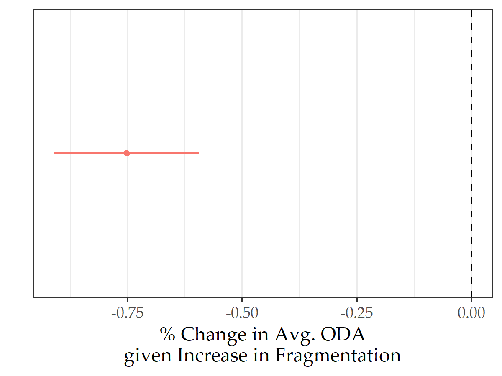

# Introduction 

From the Bretton Woods conference in 1944, to national security debates in the 21$\text{st}$ century, leaders of wealthy countries have long recognized that economic development and political stability go hand in hand. However, notwithstanding U.S. concerns about European economic recovery after World War II, in decades past, most leaders have not perceived underdevelopment, and the relatively localized security problems it generates, as major international threats. During the Cold War, the ideological and geopolitical standoff between the West and the Soviet Union dominated the objectives of foreign policy. Tools like foreign aid, though ostensibly intended to promote development in the needest countries, often served other diplomatic ends---like supporting autocratic regimes loyal to the West. However, after the Cold War, and especially since the onset of the War on Terror, promoting international development has taken center stage in high level foreign policy debates within and between the world's leading industrialized states. In a globalized world, problems in developing countries have transnational consequences. Convinced that underdeveloped parts of the world serve as incubators of extremism and insurgency; as drivers of illicit drug flows, human trafficking, mass migration, refugees, and potential pandemics; leaders of wealthy countries view economic aid as an indespensible tool in the promotion of international stability, security, and prosperity. In a globalized world, international development and international security are inseparable.

While the above foreign policy objectives have been well studied, what remains unclear is how industrialized countries' simultaneous efforts to promote international development either create opportunities for international collaboration in aid policy, or else spiral into free-riding or strategic competition for diplomatic influence. As common interest in addressing the root causes of discontent, instability, and violence in developing countries has emerged among industrialized states, this has generated repeated calls for, and efforts to promote, cooperation among aid donors. Cooperative arrangements include transparency and data-sharing initiatives supported by Development Assistance Committee (DAC) members of the Organization for Economic Co-operation and Development (OECD), delegation of aid funds to multilateral agencies like the World Bank and various regional development banks, the creation of joint assistance strategies (JAS) among donor countries, and sector-wide approaches (SWAPs) among donors to pool resources in supporting sector-specific aid programs (Lawson 2013).

*Have efforts to promote cooperation been successful?* *Or, do foriegn aid donating countries succumb to myopic incentives to free-ride, exploiting the aid expenditures of peers, or else compete with the aid of geostrategic and market rivals?* These are not new questions, but firm answers remain allusive. On the one hand, collaboration is made difficult by the fact that engaging with a low- or middle-income state to promote development is not always a politically neutral act. Leaders of donor states often expect to receive political and economic concessions in exchange for providing development resources to recipient countries. These may include market access, political favors, military alliances, and so on.\footnote{This is not to mention possible domestic gains that stem from policymakers' ability to take credit for successful aid projects.} Such goals may lead to competition among industrialized states if these benefits come at the expense of others.\footnote{For example, in an anonymous interview a German aid official once complained that Germany's position as only the seventh largest bilateral ODA donor to Bangladesh "diluted" Germany's influence in this country (Steinwand 2015).} Such competition can also be inefficient, since it leads donors to give more aid than is minimally necessary to receive their desired concessions (Bueno de Mesquita and Smith 2016), while the pursuit of nondevelopment goals can detract from the effectiveness of aid in promoting economic development (see Bearce and Tirone 2010).

Aside from these strategic goals, common interest in promoting development to mitigate diffuse spillovers of developing country problems creates a class public goods problem, generating incentives to free-ride on fellow donors. This can result in Pareto inefficient supply of aid funding by industrialized countries when donors pursue goals that benefit the entire international community. Free-riding can even be a concern in promoting strategic aims when donors have complementary geostrategic and commercial interests.

To cooperate successfully, a clear understanding of the factors that facilitate ease of cooperation, and of the sources of cooperation failure, is necessary. Unfortunately, though a small but growing cadre of scholars has applied a diversity of theoretical and empirical approaches to-date to shed light on these issues, conclusive answers remain elusive. 

In this dissertation project, I propose to study the rivalry and collective action problems that emerge in industrialized state's efforts to promote international development. When *and* where *are industrialized countries likely to free-ride or compete in the allocation of development resources?* Furthermore, *under what conditions is cooperation most feasible?* 

The main limitation of previous attempts to answer these questions lies in the all-too-common presumption that either only free-riding or only competition obstruct the path to collaboration. To the contrary, I argue that incentives to free-ride or compete vary across contexts---namely, due to factors specific to donor-recipient relations---that previous studies either ignore or only account for in narrowly defined terms.

I propose starting from a more rigorous theoretical foundation than has been considered to-date. In so doing, I will be able to more clearly identify the conditions under which free-riding, competition, and cooperation are likely to occur among industrialized countries in promoting international development. The predictions my theoretical approach generates, and the results from the empirical analyses I undertake to test these predictions, will represent a novel contribution to the literature on the political economy of international development, which has hitherto lacked a clear and well-supported statement on strategic and cooperative action among foreign aid donors.

In this dissertation prospectus, I first provide motivation for my research. In particular, I highlight the relevance of international development for contemporary international politics in light of increased perception by world leaders of the threat posed by poverty and political instability in developing countries. I further situate this contemporary concern in a broader context that dates back to the Marshall Plan implemented by the US after World War II.

Having provided necessary background details, I subsequently lay out my theoretical argument, in addition to results from some preliminary empirical analyses. I then situate my theoretical and empirical findings in reference to previous studies that address donor interactions. I further provide an overall outline of the broader dissertation project.

With respect to theory, I lay out a formal model, discuss its predictions for free-riding and competition among foreign aid donors, and outline some extensions to the model I will consider in the dissertation. Predictions from the model that I discuss include the expectation that when donors are allies (that is, have overall common interests), free-riding is likely to occur. However, the model further predicts that the extent to which donors free-ride diminishes in proportion to the marginal benefit donors receive from the impact of foreign aid. Consequently, free-riding should be most problematic when and where actors' marginal benefits from the supply of public goods are relatively low.

Further, because donors interact in a multi-recipient environment, strategic reactions with respect to one recipient have implications for reactions across recipients. The implication of this multi-dimensional environment is that heterogeneous preferences over where to give aid lead to specialization among donors in the allocation of resources to certain recipients. Under specialization, donors give more aid to a recipient than they would otherwise. However, where donors have overlapping preferences over where to give aid, they are each likely to give less aid than they would absent peers, and no donor is likely to specialize. 

Several scholars lament the negative implications of donor fragmentation (the absence of donor specialization). This finding from the theoretical model suggests a mechanism whereby aid fragmentation leads to inefficient development outcomes. Where aid is increasingly fragmented, recipients are likely to receive less aid on average from donors due to free-riding. As a result, aid projects are most likely to be funded at a Pareto suboptimal rate in a fragmented donor environment.

With respect to empirics, I summarize and test some predictions generated from the theory. In particular, I examine strategic reactions in the aid allocation decisions of 28 Development Assistance Committee (DAC) members. The analysis is novel in several respects. 

First, I develop a new unified measure that captures the marginal benefit donors receive from giving aid to a given recipient. The use of this unified measure allows me to parsimoniously examine how variation in the marginal benefit a donor receives with respect to a recipient conditions its free-riding response to aid from fellow DAC countries. Few studies have yet shown how reactions to other-donor aid are affected by donor preferences with respect to certain recipients.\footnote{Some have used export market share as a means to weight peer aid allocations; however, a weighting scheme is qualitatively different from the type of interaction implied by my theoretical model. I'll discuss one of these studies in a latter section.}

Second, to adjust for the degree to which fellow DAC member aid is expected to provide a public benefit for the international community, I apply a novel weighting scheme to aid given by peers using the newly developed Principled Aid Index (PAI). The PAI measures the extent to which a foreign aid donor's overall aid program is oriented toward addressing recipient need and promoting long-term sustainable development outcomes in stead of short-term political objectives. By weighting peer aid by PAI, I am able to attribute greater weight to aid from countries whose aid policy is most oriented toward efficient development promotion.

The results from a dyadic panel analysis of DAC member bilateral aid commitments confirms the prediction that countries (when they are allies) free-ride on the aid of peers. However, as predicted by theory, the extent to which donors free-ride diminishes in proportion to the marginal benefit of the impact of aid donors enjoy with respect to a recipient. Where a donor cares a great deal about a particular recipient country, there appears to be no free-riding.

I further test additional implications of the theory. To confirm the findings from the dyadic panel analysis, I compare the observed level of within-recipient specialization by donors in a given year to the predicted level of specialization if donors gave aid purely on the basis of their interests, and not in response to aid from peers. I use a random forest model to generate counterfactual predictions of the system-wide level of specialization. This allows me to test the prediction that strategic reactions among donors with common interests leads donors to specialize by giving more aid where peers give less, and less aid where peers give more. Results confirm that observed specialization is greater than we would expect if donors only gave aid according to their preferences. This supports the finding that DAC countries substitute in the provision of bilateral aid.

Finally, I test the prediction that increased fragmentation of aid flows implies less average aid received by a recipient country due to free-riding. In particular, I examine within-recipient variation in average ODA received over time as a function of fragmentation of aid flows. The results are consistent with expectations. An increase in fragmentation is associated with a decline in average aid received from donors.

With respect to the overall plan for the dissertation, I propose several substantive chapters, in addition to introductory and concluding chapters. 

The first substantive chapter will lay out and analyze the formal model of strategic aid allocation discussed in this prospectus in greater detail. I will discuss equilibria that emerge from the model, comparative statics, and variation in the feasibility of cooperation. This analysis will allow me to identify testable implications from the model, in particular, predictions about *when* and *where* competition or free-riding are likely to occur in bilateral aid allocation, and the recipient-level and system-level implications of these behaviors. I further will assess the feasibility of cooperation given variation in donor preferences and the degree to which aid from peers is seen as rival or complementary to a donor's goals.

The second chapter will focus on motivating and describing the novel measures I use to (1) capture strength of donor interest in recipients, (2) the degree to which peer aid is expected to effectively promote development, and (3) counterfactual specialization. 

The third substantive chapter will consist of large-$n$ analyses of dyadic panel data. These will include the analyses summarized in this prospectus, in addition to many more. I will test the myriad macro predictions from the theoretical model by estimating when and where free-riding, competition, and cooperation occur, the implications of these behaviors for average aid received by developing countries over time, and the degree of aid fragmentation across recipients. 

The fourth substantive chapter will be dedicated to validating the extent to which decisionmakers in donor countries think in terms of free-riding and competition. With the aid of a survey experiment of political elites, I will examine how individuals in a position to determine where foreign aid gets targeted think about aid from other donors. Not only will this (hopefully) complement the results from the dyadic panel analysis, this elite-level data will serve as a novel contribution in their own right. Most analyses of donor interactions focus on collecting data on where aid monies go, while much less attention is typically given to the rationales of key decisionmakers who shape where aid gets targeted.

The firth and final chapter will consist of an in depth analysis of strategic donor interactions in Malawi. Plagued by persistent poverty, Malawi has drawn the attention of several prominent donor countries for years. As a former protectorate of the UK and member of the Commonwealth, the UK's Department for International Development (DFID) maintains a strong interest in supporting positive outcomes for Malawi. Further, Malawi has diplomatic ties with several Western countries, including the US which from 2002 to 2014 gave more ODA on average to Malawi than any other donor. 

Studying donor interactions in the context of Malawi is useful for several reasons. The first is that data availability is high. Due to the work of the AidData project, quality data of aid programs implemented at the regional level are available. This provides a useful opportunity to consider cooperation across geographic-specific contexts and programs, rather than only at the national level. A second reason is that, in the face of recent research that suggests donors have failed to collaborate in Malawi (see Nunnenkamp, Sotirova, and Thiele 2016), the Malawian government has taken initiative to promote greater donor collaboration and coordination in its 2018-2030 National Resilience Strategy. This provides a unique opportunity to examine the effectiveness of one type of cooperative solution (recipient-led coordination of development partners). A final reason to focus on the Malawian case is that prior work to explore donor collaboration in Malawi is primarily descriptive, leaving open many questions about reasons for the perceived failure of donors to cooperate.

# International Development: Why Care?

## Development as Security Policy

The September 11, 2001 terrorist attacks by al-Qaeda on United States soil shocked American foreign policy from its post-Cold War slumber. As historian John Lewis Gaddis notes, where "there was very little sign of a comprehensive grand strategy...9/11 forced us basically to get our grand strategic act together."\footnote{ Transcript from PBS Frontline interview: https://www.pbs.org/wgbh/pages/frontline/shows/iraq/interviews/gaddis.html; accessed January 30, 2020. } This pivotal event showed the US and the rest of its industrialized peers that threats to national security exist beyond rival nation-states. In horror, the world witnessed non-state actors based in a poor and faraway country inflict mass casualties and destruction on the most powerful and wealthy country on the globe. 

In a context of increasing cross-border migration, communications, and commerce---a set of phenomena that Robert Keohane and Joseph Nye (1977) call "complex interdependence"---9/11 cajoled the leaders of industrialized countries into responding more proactively to the ostensible threat posed by poverty and state fragility abroad to security at home. In response to these transnational threats, the Bush administration, in an unprecedented move, raised international development to the level of defense and diplomacy---the "first tier of U.S. foreign policy priorities" (Lancaster 2008, 4). Other industrialized countries followed suit. Since 2001, policymakers across wealthy states increasingly cite problems ranging from poverty, conflict, terrorism, and natural disasters as existential threats to national security in foreign policy documents. Further, these countries have emphasized development promotion as a strategy for combating these problems. The Swiss Foreign Policy Strategy, for instance, notes that "conflict or crisis even in a faraway land often has direct consequences for Switzerland."\footnote{See page 5 of the Swiss Foreign Policy Strategy, 2012-15.} The document goes on to describe the role of development assistance in minimizing these consequences for Swiss citizens, and for Europe in general.

Sarah Bermeo (2018) refers to the widespread pattern of self-interested development promotion that has emerged since the turn of the century as "targeted development." Similar to Alexis de Tocqueville's idea of "enlightened self-interest" (that the best way to help oneself is to help others), the theory of targeted development holds that in the post-9/11 world, industrialized states increasingly promote international development to benefit themselves. However, in an important distinction between it and Tocqueville's ideal, the theory claims "that industrialized states pursue development *when* and *where* it benefits themselves, not simply *because* it benefits themselves" (Bermeo 2018, 5). That is, industrialized states do not simply promote development whenever and wherever need exists. Rather, they take a targeted approach, promoting development when and where doing so is deemed strategically advantageous.

## Self-interested Development: Back to the Past

Though the salience of development promotion as a means of supporting national security has increased substantially in the twenty-first century, self-interested development promotion is not a new strategy. In the years after World War II, a decimated Europe struggled to rebound. Industrial production on the Continent languished, and high rates of unemployment and food shortages persisted. As discontent among everyday Europeans grew, so too did popular support for communist parties across several Western European countries. Troubled by the idea of Soviet-inspired communism gaining a foothold in the West, the US responded. It did so in the form of the 1948 Economic Cooperation Act, which initiated the European Recovery Program, otherwise known as the Marshall Plan.

Named after then Secretary of State George Marshall, the establishment of the Marshall Plan stands as one of the most pivotal moments in the twentieth century. As Henry Kissinger later reflected, the Marshall Plan was nothing short of a "new design for American foreign policy," a "clarion call to a permanent role for America in the construction of international order."\footnote{ Henry Kissinger offered these reflections in a May 22, 2015 article for \textit{The Harvard Gazette}, accessed Feb. 19, 2020: https://news.harvard.edu/gazette/story/2015/05/reflections-on-the-marshall-plan/ } In a commencement speech at Harvard University in 1947, George Marshall laid out his plan for European recovery. His premise was simple: economic crisis begets discontent begets political instability. Political instability, in turn, had left Western Europe vulnerable to a Soviet Union that had already succeeded in converting the territory its forces occupied at the end of World War II into a block of communist satellite states.

Marshall's solution was simple: the US, the world's leading power after the war, would promote economic recovery, preserve political stability, and stay the spread of communism in Europe with financial assistance and the facilitation of economic integration. Bold though the plan was, it succeeded and since has been praised as one of the best examples of a successful foreign policy initiative (Woods 1997).

Perhaps more important for the theory of targeted development, Western Europe was not the only part of the world in need of economic recovery and development, nor was it the most in need. East Asian and African countries also could have benefited from US assistance, but such areas of the world were seen by the framers of the post-war international order as distant problems (Mallaby 2005). However seriously US leaders took Marshall's premise that economic woes breed political instability, they saw problems rooted in Western Europe's economic devastation as a far greater and more urgent threat to the US than problems in Latin America, Africa, and East Asia.

This is the essential marker of targeted development. The US offered more than 13 billion dollars of development assistance to Western European countries, not because the region was the most in need, but because it was where "development would best serve the goals of the donor state" (Bermeo 2018, 20). To be sure, development was not the only goal of US leaders. They also sought to promote a European market for US goods and to balance against an emerging Eastern rival. But such goals, more than complementary to efforts to promote economic recovery and development, would not have been possible without it.

## The Marshall Plan Resurgent and New Collective Action Problems

Much like the US's rationale for the Marshall Plan after World War II, today, industrialized countries see promoting development, when and where it is advantageous to do so, as an important foreign policy goal. As previously noted, in the current century, globalization has made the world's leading industrialized powers vulnerable to a host of problems that they previously had the luxury to ignore. Countries such as the US, the UK, France, Germany, and Japan increasingly view promoting development in the countries of East Asia, Africa, Latin America, the Middle East, and Eastern Europe as a solution to a host of diffuse and threatening spillovers rooted in poverty and political instability. 

However, the environment that actors inhabit today differs markedly from the situation that faced the US after World War II. Crucially, the multiplication of countries that care about promoting development---more than indicative of a widespread shift in industrialized country strategy---adds a layer of complexity to the problems states face today by introducing a collective action problem on top of efforts to pursue a strategy of targeted development. Industrialized countries face a classic public goods problem with attendant incentives to free-ride (Olsen and Zeckhauser 1966). However, due to the multi-dimensional and targeted nature of industrialized country interests in promoting development across a large number of recipient countries, actors must navigate a collective action space with implications that extend beyond standard models of public goods provision. Donor interactions with respect to one developing country have consequences for interactions in another.

To complicate matters further, just as US efforts to promote development in Western Europe after World War II provided additional strategic benefits---like greater trade and empowered allies to aid the US in its ideological and geopolitical struggle against the Soviet Union---states today also stand to gain a number of strategic advantages as a consequence of promoting development in low- and middle-income states. These benefits can sometimes serve the common interest of the donor community, but they may also serve the goals of some to the exclusion of others. 

## The Implications of Rivalry and Collective Action in International Development

Targeted development provides a helpful framework within which to explore how actors navigate a complex collective action problem with a mix of common and rival benefits. While poverty and state fragility pose a *collective* threat to industrialized countries, the intensity of these threats is not constant across actors. Because of this, though the benefits of development promotion in a given low- or middle-income country are not exclusively enjoyed by any one industrialized state, not all states gain from development in equal proportion.

For this reason, self-interested behavior like *free-riding* or *easy-riding*, which characterize the classic public goods problem, have different implications in a multi-dimensional collective action problem than they do in the standard, single public good case. Study of multi-public goods economies remains rare, but what work does exists suggests that, unlike with a single public good, free-riding in a multi-public good environment can lead not only to shortfalls in the supply of public goods relative to the Pareto optimal supply, but also an inefficient mix and *oversupply* of public goods that detracts from actors' ability to promote other, privately enjoyed, goals (see Cornes and Itaya 2010).

Further, as with the Marshall Plan, states today may enjoy a range of strategic benefits by promoting development that extend beyond security. For instance, supporting development can create new export markets for industrialized country goods and promote general goodwill toward the donor---not to mention policy favors donors may receive in exchange for providing aid, like votes in an international organization. Such benefits may either mutually benefit industrialized countries (for example, when these countries are allies, such as OECD members), or have rival benefits (e.g., between the US and China). In the former case, these additional benefits only compound the public goods characteristics of promoting development. However, in the latter case, competition for rival nondevelopment benefits can lead to inefficient spending by donors and can potentially lead states to direct resources away from other places where they would benefit from promoting greater development.

Irrespective of the rival and common interests of donors, cooperation can provide Pareto optimal benefits for all (even rivals) if states could agree to forego the temptation to free-ride or compete. However, should we be optimistic about prospects for cooperation? When and where are opportunities for exploitation or for seizing strategic advantage vis-$\grave{\text{a}}$-vis rival powers too good to pass?  

These questions are both timely from a policy perspective, and also reflect timeless questions about collective action problems. Though targeted development is not the only framework within which to explore these issues, it is a useful one that encapsulates a variety of complex interrelations among states who must simultaneously navigate common and conflicting goals. 

In the following section I turn to a consideration of the goals of industrialized countries with respect to development cooperation over time, placing targeted development in historical context alongside other industrialized country priorities.

# Donor Motivations and Targeted Development in Historical Context

Scholars continue to debate the motives of countries that allocate foreign aid. Traditionally, those who hold that aid is given for selfish, non-development reasons have been pitted against those that contend donors have humanitarian objects. However, the debate today has progressed in more fruitful directions, shifting away from identifying *if* aid is given for this or that reason, toward instead identifying *when* and *where* different motives are in play (see, for example, Heinrich 2013). In this vein, some consensus has formed around evolving donor motivations over time. In particular, scholars point to three distinct periods in world politics where differing donor motives were likely at the forefront of counties' foreign policies. These periods are the Cold War, the post-Cold War decade, and the post-2001 period. Each era lends itself to a distinctive emphasis of development cooperation: *quid pro quo*, recipient need, and self-interested development promotion. Though these emphases are not mutually exclusive (countries may harbor all three goals at once), historically, countries have prioritized one set of goals relative to the others, and sometimes to the detriment of others, as differences between the Cold War and post-Cold War periods will highlight. 

After describing these frameworks for understanding the motivations of industrialized countries, I turn to the literature that considers strategic interactions among countries in light of these differing views of industrialized country motives. 

## Quid pro Quo and the Cold War

As many observers of the Cold War period note, despite the success of the European Recovery Program (the Marshall Plan), its logical extension to other developing parts of the world failed to materialized in the years after Europe's recovery. Some worried that foreign aid had become nothing more than a form of bribery, a continuation of a common way of conducting foreign policy up to the nineteenth century (Morgethau 1962). The reasons for this are many, but two are worth special mention. 

The first, as Bermeo (2018) highlights, is that US policymakers had different time horizons with respect to Europe relative to the rest of the world. The Administrator of the European Recovery Program, Paul Hoffman, saw clearly that the US's assistance to Europe filled the "critical margin" needed to bring prosperity back to the Continent. However, "more than a 'margin' would be needed to raise citizens to a 'reasonable degree of prosperity'" in other developing parts of the world (Bermeo 2018, 21). In other words, there were doubts about how well the Marshall Plan would travel outside of Europe. The project of promoting recovery in Europe where once vibrant industrialized economies flourished seemed a much easier task than promoting development from scratch in other parts of the world.

The second reason is that Cold War anxieties about the spread of Soviet-inspired communism led the US, as George Kennan noted in 1949, to "economize" by committing resources where they would "do the most good" (Gaddis 2005, 30). Whereas the most good was defined in terms of recovery and development under the Marshall Plan, US interests moving forward would be dominated by the goal of containment. While achieving this goal did include allocating development resources to low-income parts of the world, emphasis was placed on giving aid where Soviet influence was perceived as most threatening. While development would certainly have been a desirable byproduct of this strategy (and efforts to improve development outcomes were undertaken), the economist Milton Friedman observed that by the end of the 1950s, foreign aid clearly had been, first and foremost, "a weapon in the ideological war" between the US and the Soviet Union with the "assigned role...to help win over to our side those uncommitted nations that are *also* underdeveloped and poor" (1958; emphasis mine). 

The word "also" used by Friedman is worth emphasizing. The goal of the US, and what would also become the goal of its Western allies, was to prevent the spread of communism. While this strategy entailed giving resources in the form of foreign aid to strategically valuable developing countries, the fact that these countries were developing was only marginally relevant; save that poorer countries were conceivably easier to buy off (see Bueno de Mesquita and Smith 2009).

This feature of aid-for-policy exchange distinguishes it from the strategic advantages that attend targeted development promotion. The Marshall Plan, for instance, yielded strategic benefits *because* of its success in promoting recovery and development in Western Europe. Conversely, many of the strategic objectives sought by the US during the height of the Cold War could be realized whether aid promoted development or not. This is not to say that concern for promoting development was entirely absent; it was, however, of secondary concern. The US gave billions of dollars in aid to despotic, authoritarian regimes during the Cold War. Policymakers did not do this in the naive belief that these monies somehow would be appropriately channeled toward economic and social development. Instead, the goal was to keep these authoritarian regimes on friendly terms with the US vis-$\grave{\text{a}}$-vis the Soviet Union.

Those who contend that foreign aid served a primarily *quid pro quo* function, of course, do not think aid was given solely for geostrategic reasons during the Cold War period. For example, Japan, which briefly superseded the US as the world's largest foreign aid donor by the end of the 1980s, was argued to use development resources to further its own economic interests. *Kokueki* (or national interest), as Schraeder, Hook, and Taylor note,"was the critical motivating factor of [Japan's] foreign aid policies during the post-World War II period" (1998, 300).

Meanwhile, scholars note that France leveraged its foreign aid in service of the *rayonnement*, or the spread of French culture and language (Kolodziej 1974). French foreign aid, consequently, was highly concentrated in former French colonies, particularly francophone colonies, and protectorates. The goal of spreading French culture went hand-in-hand with an economic agenda centered around an "integrated system of economic relationships" and close cultural and linguistic ties (Hayter 1966, 43).

Nevertheless, whatever the substance of aid-for-policy exchange, whether aid was given for geostrategic, economic, or cultural reasons, the nature of such exchanges were generally the same. Donors sought concessions (allegiance, market access, influence) which recipients provided in exchange for aid.\footnote{ It bears noting that the conceptions of donor self-interest described in this section are not accepted by all camps that nonetheless agree that aid is given for selfish (nondevelopment) reasons. One distinction scholars often make is between realist, neorealist, and neo-Marxist conceptions of self-interest. The first emphasizes geostrategic goals, the third the economic subordination and exploitation of developing countries by developed ones, while the second views both geostrategic and economic goals as equally important. The neorealist view has its best expression in the work of political economist Robert Gilpin (1987). } And under the shadow of Cold War hostilities, Bermeo notes, "development was likely set back significantly as a result of great-power meddling" (2018, 26).

## Post-Cold War: The Rise of Recipient Need

Following the Cold War, many expected a decline in *realpolitik* motivations for aid allocation. In 1992, in the immediate wake of the collapse of the Soviet Union, IR scholar Robert Jervis predicted that "classical realism will not be an adequate guide for the future of international politics" (1992, 266). Further, as former International Studies Association President, Charles W. Kegley Jr., noted in a 1993 address in Acapulco, Mexico, humanitarianism "found a reinvigorated voice in a system where the violation of human rights poses a security threat to the entire international community" (1993, 138).

However, despite renewed optimism, it would soon become clear that with the loss of a major geostrategic rival, aid policy, particularly for the US, would lose its *raison d'*$\hat{e}$*tre* (Radelet 2003). Rather than observe a resurgent *idealpolitik* centered on humanitarian motivations, the end of the Cold War, coupled with economic recessions in several industrialized countries, led to the marginalization of development policy in the 1990s (Lancaster 2008). Subsequently, as Brautingam and Knack (2004) note, there was a substantial decline in total ODA commitments by members of the Development Assistance Committee between 1990 and 1991, a drop that persisted for the remainder of the decade.

Even so, while development seemed to decline in importance, several studies note improvements in the efficacy of development policy after the Cold War. As Woods (2005) notes, the end of the Cold War spurred new debates about how to make aid more effective at promoting development, a concern that was complemented by greater resolve by donors that the aid they allocated be put to better use. In support of this view, Meernik, Krueger, and Poe (1998) found that after the Cold War, a greater proportion of US aid was concentrated in the neediest states as measured by per capita gross national product. Though this finding alone does not necessarily mean that aid was more likely to promote development, further analysis by Bearce and Tirone (2010) shows an appreciable shift in the efficacy of aid after the Cold War. The authors find that, whereas receipt of greater total ODA by recipient countries had no significant association with either positive economic reforms or economic growth prior to 1991, from 1991 to 2001 greater ODA had a significant and positive association with both. Additional studies found that ODA was less likely to prolong the tenure of authoritarians after 1990 (Bermeo 2016; Dunning 2004; Wright 2009).

Thus, despite a decline in the salience of aid allocation for policymakers in industrialized states relative to other foreign policy goals, fruitful efforts in the 1990s were undertaken to improve the effectiveness of ODA in promoting positive development outcomes. 

The evidence from this period further highlights how emphasis on certain goals, such as obtaining geostrategically or economically motivated *quid pro quos*, can cut against the efficacy of aid in promoting development in a given country. That receipt of aid fails to become significantly associated with positive economic and political outcomes until the cessation of the Cold War speaks to this unfortunate trade-off.\footnote{It is unfortunate in the sense that citizens living in recipient countries are the losers when political goals supplant development objectives.}

## Security in a Globalizing World

In the aftermath of the September 11, 2001 terrorist attacks, it was obvious that a radical shift in geopolitics laid on the horizon. However, where this horizon would lead remained unknown. Even so, uncertainty did not stop scholars from extrapolating. Their initial predictions were not cheery, especially where development policy was concerned. However, as the world pressed forward into the new century, early pessimism transformed into renewed hope.

Much of the initial cynicism was predicated on the idea that security goals were at fundamental odds with concern about development. This is the lesson that many drew from the immediate post-Cold War decade. Geopolitics had seemingly sequestered from development cooperation the very goal of development promotion. With security again dominating the objectives of world leaders after 9/11, a decline in the efficacy of development cooperation seemed a foregone conclusion. Bearce and Tirone (2010), who found that aid led to improvements in economic reforms and growth after the Cold War, predicted that the War on Terror would reinvigorate Cold War style policies. Development, they feared, would take a back seat to donors' renewed security interests. Ngaire Woods (2005) similarly raised concerns that the prosecution of wars in Afghanistan and Iraq would supplant interest in helping the world's poorest states, rob aid budgets, and weaken interest in supporting multilateral development institutions like the World Bank.

Contrary to the cynics, as the war on terror progressed, Girod, Krasner, and Stoner-Weiss note that "governance and development in poorer countries...assumed *much greater prominence* after the attacks on the World Trade Center and the Pentagon" (qtd. in Bermeo 2018, 33; emphasis mine). In support of this view, Fleck and Kilby (2010) note both a dramatic increase in total ODA by the US following the onset of the War on Terror and an increase in the probability that low-income countries receive ODA from the US. 

In short, rather than witness world leaders sacrifice development promotion on the alter of national security, the events of 9/11 focused development policy in a way that failed to materialize during, and in the decade after, the Cold War. As Bermeo notes, development strategy was "no longer relegated to foreign aid charters but part of central discussions of national security" (2018, 34).

In short, rather than witness states substitute development policy with promoting national security, these goals dovetailed in the strategies adopted by world leaders after 9/11. This resulted in a policy of targeted development---a return to a Marshall Plan-esque approach, that is, a *targeted* approach where donors promote development *when* and *where* it best serves their goals, and where development promotion is seen as critical to promoting national interest.

# A Model of Aid Allocation in a Multi-donor Multi-recipient Environment

To summarize, while the goals of foreign aid donors have changed over time, since the turn of the century, industrialized countries increasingly pursue a targeted development strategy. In response to the perceived threat of unwanted diffuse spillovers of developing countries, policymakers increasingly view development promotion as serving their country's national interest. However, promoting development yields certain nondevelopment benefits, such as access to foreign markets, votes in international organizations, and so on. 

Here, I lay out a model that will allow me to explore the collective action problems that aid allocation generates for industrialized countries. Though emphasis is placed on the targeted development framework, the model's insights extend to donor interests as broadly defined in the previous section. The model itself merely characterizes a composite good that donors receive via allocation of aid. This good can just as easily represent geostrategic benefits as it does development promotion. 

In the model, when countries contribute development resources to low- and middle-income countries, the resources contributed by peers have an impact on the total benefit donors receive. This effect may be negative---more aid from peers reduces the total benefits donors receive---or positive---more aid from peers increases the total benefits donors receive. 

To formally capture these dynamics, I need a mathematical model that allows for some flexibility in the degree to which the activity of other states either threatens or benefits a single actor. It further needs to be both abstract enough to capture the range of goals that industrialized states may pursue, but close enough to reality to teach us something meaningful about the politics of international development.

To this end, I adapt a model proposed by Dudley (1979) to capture the strategic dynamics among allies in their total provision of bilateral and multilateral foreign aid. This model is a generalization of Olson and Zeckhauser (1966) that allows for the possibility of rivalry among allies in promoting a collective good.\footnote{I discuss Dudley 1979, as well as other attempts to address inter-donor reactions in a later section.}

I go beyond Dudley's model, however, by making two adjustments that I think better capture the relevant aspects of the politics of international development. First, Dudley relies on a median voter approach to assess demand for aid in each donor country. I drop this assumption. While citizens of industrialized countries may reasonably have some preference over foreign aid spending---namely, whether they would like more or less of it---it would stretch credulity to suppose the median citizen has well-defined preferences over how to distribute aid across a large number of foreign aid recipients. I therefore modify the model to represent demand for aid giving at the level of the state. 

This decision is predicated on the idea that the state can be treated as a unitary rational actor with well-defined preferences. Though this assumption obscures the reality of how foreign aid budgets are set and how that aid is distributed (a process that usually involves complex inter-agency and inter-branch politics), this level of abstraction is a necessary step in constructing the model. The immediate goal here is not to learn something about the nuances of intra-state decision-making. Rather, the goal is to learn something about the way the goals of states collide or align in the international system. To do so, it is useful to take the objectives of states, treated as unitary actors, as given, and then to proceed to understand how these objectives shape the strategies states pursue to realize their goals. It may be useful to think about donor goals as being determined by some social aggregation function that takes the totality of society-wide preferences and maps them to a well-defined set of priorities over recipient countries for a given donor state. Policymakers, interested in maintaining power, take steps to realize these preferences by setting foreign aid policy in line with preferences as defined by this social aggregation function.

However, while I abstract to the level of the state as a unitary actor, I add to Dudley's model a new layer of complexity. While Dudley models only the total level of aid expenditures by donors, I focus on aid expenditures with respect to each aid recipient simultaneously. When countries allocate aid, they do not only set the total level of expenditures, but also how those expenditures will be distributed across developing countries. Further, in doing so, factors that inform the amount of aid a donor would like to give one recipient are not independent of the factors that inform the amount of a aid a donor would like to give to another. Expanding the model in this way yields insights that a narrow focus on either total expenditures or with respect to only a single recipient independent of others misses.

## The Model

Let the quantity $H_{dr} \in \mathbb{R}_+$ denote a good that we may call "the impact of aid," which is enjoyed by an industrialized country $d$ with respect to a developing country $r$. The impact of aid is simply a composite or combination of all the goals that a donor may have (aid-for-policy exchange and targeted development) defined in the broadest terms possible.\footnote{In this set-up, I assume that these analytically distinctive goals nevertheless have the same properties such that we can think of $H_{dr}$ as a simple sum of development and strategic benefits. What simplicity we gain from this characterization, we necessarily lose in our ability to learn something about how development objectives can be sacrificed for policy concessions. Such an extension of the model is beyond what I wish to consider here; however, it would make for a useful addition to the dissertation.} Further, let the impact of aid with respect to $r$ be a linear function of aid from $d$ to $r$, and of aid from all other industrialized countries to $r$, which I denote as $\dot{A}_r$:
$$H_{dr} = a_{dr} + \beta \dot{A}_{r}. \tag{1}$$
The term $\beta$ in the above captures the degree to which aid from all other donors affects the impact of aid enjoyed by a single donor with respect to recipient $r$. For now, this is assumed to be a system-level parameter. I plan to relax this assumption in my dissertation, but for now a systemic parameter is useful if only to introduce the model and some its general predictions.

If $\beta > 0$, aid from other donors *increases* the impact of aid enjoyed by $d$. As such, the impact of aid is a *public good*, both *nonrival* and *nonexcludable*. That is, peer aid does not detract from the impact of aid enjoyed by $d$ (nonrival). Furthermore, $d$ may enjoy the impact of aid without paying for it as long as peer aid is nonzero (nonexcludable).

In the special case that $\beta = 1$, the impact of aid with respect to $r$ is a *pure* public good (1 dollar of aid from $\neg d$ has the same impact as 1 dollar from $d$). Otherwise, if $0 < \beta < 1$, the impact of aid with respect to $r$ is an *impure* public good (only a fraction of aid from $\neg d$ has the same impact as 1 dollar from $d$). The impact of aid could be an impure public good if, for example, some of the goals that donors pursue with aid are either unique to the donor that gives aid, or else zero-sum and thus at the cost of the impact of aid enjoyed by others.

Alternatively, if $\beta < 0$, aid from other donors *decreases* the impact of aid enjoyed by $d$. This makes the impact of aid a *private good*, or what I will also call a *rival good*. In this case, the impact of aid is both *rival* and *excludable*. That is, peer aid detracts from the impact of aid enjoyed by $d$ (rival). Further, because aid from peers does not contribute to $d$'s enjoyment of the impact of aid, $d$ must use its own resources to enjoy aid's impact (excludable). The impact of aid could be, on net, rival if the collective benefits that accrue from the promotion of development are outweighed by the loss of influence that donors obtain from the allocation of aid.

Now, following Dudley (1979), I define utility for each $d$ with the Stone-Geary formulation,
$$
u_d = \begin{cases}
\ln(Y_d - A_d) + \sum_{r = 1}^N\alpha_{dr}\ln(H_{dr} - \sigma_r) & \text{if} \quad H_{dr} > \sigma_r \forall r \\
-\infty & \text{if} \quad H_{dr} \leq \sigma_r \text{ for any } r
\end{cases}, \tag{2}
$$
subject to the constraint 
$$Y_d > A_d : A_d = \sum_{r=1}^Na_{dr}.\tag{3}$$
$Y_{d} \in \mathbb{R}_+$ denotes the total budget of country $d$, and $A_d$ the total aid given across $N$ developing countries by $d$. A state's total contribution of aid cannot exceed its total budget of $Y_d$.

In equation 2, the expression $\alpha_{dr}\ln(H_{dr} - \sigma_r)$ captures the utility of having an impact on recipient $r$ for donor $d$. Using the natural log captures that each additional unit of aid's impact yields strictly positive benefits, but at a diminishing rate. $\alpha_{dr} \geq 0$ denotes the marginal benefit of the impact of aid with respect to $r$ enjoyed by $d$. This parameter captures factors that make $d$ more or less interested in having an impact on outcomes (broadly defined) for recipient $r$. These may include bilateral ties like trade, alliances, or geographic proximity. Such factors may increase $d$'s interest in promoting development in $r$ for self-interested reasons. For example, greater density of bilateral ties may make a donor especially vulnerable to problems rooted in underdevelopment that arise in a recipient. As a result, a donor likely has more to gain by promoting development. Additionally, stronger ties may induce interest in obtaining policy favors or increase the utility of seizing political and economic influence. Note that these goals need not be exclusive.

The parameter $\sigma_r \geq 0$ denotes minimum, or subsistence, impact of aid with respect to $r$. To enjoy the impact of aid, it must be the case that $H_{rd} > \sigma_r$. Think of $\sigma_r$ as capturing features of a particular recipient that affect minimum aid requirements for $r$. These may include problems in $r$ such as poverty, state fragility, or terrorism, or else factors that give $r$ some leverage to gain greater aid from donors in exchange for concessions, such as a large domestic market or large reserves of natural resources. Though it is technically possible to define some $\sigma_r$ that is always greater than $d$'s budget constraint, here I assume that this will almost never be the case. From the empirical record, we know that donors spend relatively little on aid as a proportion of their total budgets---which would not happen, save that minimum aid requirements across recipients are small, at least relative to donor resources.

Finally, the expression $\ln(Y_d - A_d)$ captures the utility of all goods other than the impact of aid across recipients. This captures other types of national public goods that policymakers promote that exclusively benefit their own citizens. The smaller total aid expenditures by $d$, the more $d$ is able to promote these other goods, which may include spending on social programs for a donor's own citizens, infrastructure, defense spending, etc. For simplicity, I hold the marginal benefit of these goods constant at 1.

## Some Predictions from the Model

### Donor Behavior

Assuming donor states are rational and self-interested, we can take the first-order conditions such that equation 2 is maximized and solve for optimal demand for aid to $r$ from $d$. The solution is given as
$$a_{dr} = \max\left\{\sigma_r + \delta_{dr}\left[Y_d + \beta (\tilde{A}_{dr} + \dot{A}_{dr}) - \Sigma \right] - \beta \dot{A}_{dr},0\right\}, \tag{3}$$
where for convenience I define the parameter $0 \leq\delta_{dr} < 1$ as
$$\delta_{dr}:=\frac{\alpha_{dr}}{\sum_{r=1}^N \alpha_{dr} + 1}. \tag{4}$$
$\delta_{dr}$ captures the relative weight of the marginal benefit of the impact of aid with respect to $r$ for $d$.

The term $\Sigma$ captures the sum of subsistence impact of aid across all recipients,
$$\Sigma := \sum_{r=1}^n\sigma_r, \tag{5}$$
and the value $\tilde{A}_{dr}$ denotes the sum of all aid given by donors other than $d$ to all recipients other than $r$.

The use of $\max\{ \cdot \}$ follows from the restriction that $d$ cannot expend negative resources in promoting the impact of aid.

From equation 4, we may note the following:

  - Aid to $r$ from $d$ is an increasing function of $d$'s budgetary constraint $Y_d$. That is, the more resources $d$ has at its disposal, the more aid it is able to give to an aid recipient.

  - Aid to $r$ from $d$ is an increasing function of factors that raise $d$'s interest in having an impact on outcomes in $r$. Suppose, for example, that the value of $\alpha_{dr}$ (and thus the parameter $\delta_{dr}$) is greater when $d$ and $r$ have an alliance. This means that if $d$ and $r$ are allies, $d$ will give more aid to $r$ than to some other developing country that is not an ally.

  - As base demand for aid to $r$ goes up, so does aid from $d$ to $r$. The term $\sigma_r$, in effect, acts as the intercept for equation 4.
  
  - Conversely, more subsistence demand for aid in other developing countries leads $d$ to give less aid to a recipient $r$.

In addition to the above predictions, the demand equation also yields the following conditional expectations for strategic behavior by donors:

1. If $\beta > 0$ (that is, if the impact of aid is a public or collective good), then (a) greater aid from other donors to $r$ will lead to a decline in aid from $d$ to $r$, and (b) greater aid expenditures by other donors elsewhere (that is, to all recipients other than $r$) will lead to an increase in aid from $d$ to $r$.

2. If $\beta < 0$ (that is, if the impact of aid is a private or rival good), then (a) greater aid from other donors to $r$ will lead to an increase in aid from $d$ to $r$, and (b) greater aid expenditures by other donors elsewhere will lead to a decline in aid from $d$ to $r$.

3. The magnitude of each $d$'s response to peer aid is conditional on the value of $\delta_{dr}$. As $\delta_{dr}$, or interest in promoting the impact of aid in $r$, increases, reactions to peer aid to $r$ decrease, whereas reactions to peer aid elsewhere increase.

These three predictions merit some explanation.

Expectations 1.a and 2.a follow from the public or private nature of the impact of aid respectively. If the impact of aid is a public good, each donor, acting in its own self-interest, has an incentive to exploit other donors by letting their aid substitute for a donor's own. This follows from the nonrival and nonexcludable nature of public goods. For example, when the Bush administration initiated the United States President's Emergency Plan for AIDS Relief (PEPFAR), other countries were not excluded from enjoying the impact of aid given by the US toward fighting HIV/AIDS, nor were the benefits of the program rival. As such, other countries could benefit from the impact of PEPFAR without having to initiate their own versions of the program.

Conversely, if the impact of aid is a rival good, each donor, acting in its own self-interest, has an incentive to compete with other donors by giving more aid when peers give more. This follows from the rival and excludable nature of private goods. When the US ramped up its aid programs in Northern Africa in the early 2000s, French policymakers interpreted US interest in the region as driven by competition for access to oil reserves (Chafer 2005). In this instance, French officials saw US aid as rival to their own, and that France would not get to reap any of the benefits of the impact of US aid.

While predictions 1.a and 2.a are intuitive, it is less obvious why we should expect either prediction 1.b or 2.b to hold. Recall that according to 1.b, peer aid to recipients other than $r$ should increase demand for aid to $r$ if the impact of aid is a public good. Further recall that according to 2.b, peer aid to recipients other than $r$ should decrease demand for aid to a given recipient if the impact of aid is a private good. 

These predictions are driven entirely by the budget constraints that donors face. On the one hand, if the impact of aid is a public good, and if other donors give more aid to recipients other than $r$, this frees up resources that $d$ would have given to other recipients to now give to $r$. Conversely, if the impact of aid is a rival good, and if other donors give more aid to recipients other than $r$, $d$ is driven to give less aid to $r$ in order to compete with the aid other donors give elsewhere.

It bears noting that a fixed budget constraint seems an inappropriate imposition on industrialized countries, many of which can either print their own money or borrow on the cheap in order to spend more and more money if the need arises. However, in the context of foreign aid, a budget constraint is a reasonable assumption. As Heinrich, Kobayashi, and Bryant (2016) show, during economic downturns, even while countries increase total government spending, foreign aid expenditures tend to decline, both as a fraction of total government outlays, and in absolute amounts. This is due to the domestic political costs of funding aid programs during bad economic times. When the economy shrinks, so too does the pool of resources that governments make available for foreign aid projects. 

Further, econometric analyses consistently find that states with higher GDP also give more foreign aid in absolute terms. Thus, even if budget constraints are transient, states nevertheless seem to set their budgets in reference to some sense of a budgetary limit or capacity to leverage resources in service of foreign policy goals pursued through aid allocation.

Finally, recall prediction 3, which states that the intensity of donor reactions to peers is conditional on strength of preference for promoting the impact of aid in a given recipient. In particular, as strength of preference increases, reactions to peer aid to a recipient decrease, while reactions to peer aid elsewhere increase. 

We can see where these predictions emerge in the model by considering the partial derivative of aid to $r$ from $d$ with respect to peer aid, and with respect to peer aid elsewhere (that is, to recipients other than $r$):
$$
\begin{aligned}
\partial a_{dr}/\partial \dot{A}_r & = \delta_{dr}\beta - \beta , \\
\partial a_{dr}/\partial \tilde{A}_r & = \delta_{dr}\beta.
\end{aligned}\tag{6}
$$
We can see from the above that as $\delta_{dr} \to 1$, the value of $\delta_{dr}\beta - \beta$ approaches zero. Meanwhile, the value of $\delta_{rd}\beta$ approaches the value of $\beta$.

The intuition behind this finding may seem obscure. However, it makes sense that reactions to peers are conditional on the marginal benefit of the impact of aid for a given donor. If the marginal benefit of promoting the impact of aid is high, and if the benefit of the impact of aid is a public good, a donor is less likely to exploit other donors due to the high value it attaches to having an impact with respect to $r$. However, if the marginal benefit of having an impact is low, a donor is more willing to let aid from peers substitute for its own. 

Relatedly, if the impact of aid is a public good, and if the marginal benefit of having an impact in $r$ is high, a donor is more likely to exploit the aid that other donors give elsewhere in order to give more aid to $r$. However, if the the marginal benefit of having an impact in $r$ is low, a donor has less incentive to exploit aid given by peers elsewhere to free up resources that it can give to $r$.

Conversely, if the impact of aid is rival, and if the marginal benefit of having an impact is high, then the need to compete with the aid from other donors is low. This is because a donor, absent aid from peers, already contributes a sizable share of its aid toward a recipient. Due to budget constraints, competition beyond what a donor already contributes is especially costly. However, if the marginal benefit of having an impact on a recipient is low, then competition is more affordable since a donor's level of giving absent aid from peers already would have been relatively low.

Furthermore, if the impact of aid is rival, and the marginal benefit of having an impact in $r$ is high, then peer aid elsewhere is more likely to incentivize a donor to reduce aid to $r$. Since the marginal benefit of having an impact in $r$ is already high, a donor can get away with pulling back some of its resources that it would otherwise give to $r$ in order to compete with the aid that peers give elsewhere. Alternatively, if the marginal benefit of having an impact in $r$ is low, then a donor has less wiggle room to redirect aid from $r$ to other recipients where peers contribute more aid. This is because aid to $r$ from $d$ absent peer aid already would be relatively low.

### Recipient and System Level Outcomes

Beyond implications for strategic donor behavior, the model yields predictions at the level of the individual recipient and the systemic level as well. These predictions concern both the average amount of aid that a recipient receives from donors (recipient level), and the degree to which, on average, aid that any given recipient receives comes from a variety or a concentrated set of donors (system level). 

Though it would be natural to first discuss the recipient level predictions, I begin with the system level predictions since the logic that undergirds them is helpful for understanding the former:

1. If the impact of aid is a public good, to the extent that donors have differing marginal benefits from the impact of aid across $N$ recipients, we should expect to see higher levels of observed *specialization* on average relative to a counterfactual world where donors do not react strategically to the aid of peers.

2. Conversely, if the impact of aid is a rival good, to the extent that donors have differing marginal benefits from the impact of aid across recipients, we should expect to see lower levels of observed *specialization* on average relative to the counterfactual world.

These predictions require some explanation, but first, let me define what I mean by "specialization." Specialization is simply a description of the degree to which a single donor, or a subset of donors, is responsible for the majority of aid received by a given developing country. In finance, the analogue to specialization is market share concentration, or the degree to which a firm dominates the market within a given industry. This is often measured by the Herfindahl Index (HI), which is the sum of the squared proportions of market shares across firms. In the case of foreign aid allocation, this is the sum of the squared proportions of aid to a recipient allocated by each donor. The resulting measure is equivalent to the probability that two randomly drawn dollars of aid given to a recipient come from the same donor. The higher this probability, the more a single donor, or smaller set of donors, is responsible for the total amount of aid received by a developing country.

Now, let me explain what I mean by the *counterfactual* level of specialization. This is simply the degree to which specialization would occur in a given aid recipient *if* donors allocated aid strictly on the basis of the marginal benefits they receive from the impact of aid. In other words, it is the level of specialization we would observe absent strategic reactions by donors to the aid allocations of peers.

The model described in the preceding section predicts that, to the extent that donors have differing preferences over where to give aid, and if the impact of aid is a public good, observed average specialization at the system level will be greater than in the counterfactual world where donors only allocate aid on the basis of their preferences. Alternatively, if the impact of aid is rival, then average specialization will be lower relative to the counterfactual world. 

These predictions follow from the way donors strategically optimize their limited resources across recipients. If the impact of aid is public, to the extent that donors receive differing marginal benefits from aid, donors are free to specialize in promoting the impact of aid where doing so most benefits themselves. Meanwhile, they can get an easy or free ride off of the aid that donors allocate elsewhere. The result is that the average level of observed specialization across recipients is higher than the average level of counterfactual specialization across recipients if donors gave aid purely on the basis of their interests.

This prediction, it is important to note, is predicated on donors having differing preferences over where to give aid. Though we should expect some degree of overlap among donors, it would be unreasonable to expect that any two donors have exactly the same preferences. In the real world, there will always be some degree of heterogeneity in preferences. Therefore, if the impact of aid is a public good, we should expect to observe higher levels of specialization on average relative to the counterfactual level.

However, if the impact of aid is rival, the observed level of specialization in the system will actually be lower than the counterfactual level. Again, this prediction is partially predicated on donors having some degree of heterogeneity in preferences. In a counterfactual world where donors do not act strategically and receive differing marginal benefits from the impact of aid, we will observe some degree of specialization purely due to donors having different priorities over recipients. However, if donors also act competitively, any specialization that would otherwise occur will be mitigated as donors vie for rival benefits. This is due to donors giving more aid to recipients that they would otherwise care little about purely in an effort to compete with rivals.

These system level predictions additionally are tied to important recipient level outcomes, namely, the average aid that recipients receive from donors:

1. If the impact of aid is a public good, then a decline in observed specialization should be associated with a decline in average aid received by a given recipient.

2. Alternatively, if the impact of aid is rival, then a decline in observed specialization should be associated with greater average aid received by a given recipient.

The first prediction is driven by an increase in free-riding when there is greater overlap in where donors give aid, while the second prediction is driven by an increase in competition when there is greater overlap in where donors give aid. 

### Implications for Cooperation

The above predictions follow from assuming single-shot game play by rational and self-interested actors. However, the model can also be analyzed with an eye toward cooperation; or at the very least, with the feasibility of enforcing cooperative arrangements kept in mind. I plan to flesh out these considerations in greater detail in my dissertation. For now, I would like to only preview how I will go about assessing the feasibility of cooperation and discuss how parameters of interest are expected influence cooperation's feasibility.

However, before entertaining a framework for studying prospects for cooperation among donors, it first is important to note that cooperation is expected to be beneficial. Much like many strategic models of the form considered here, if states engage in Nash behavior, the result is Pareto suboptimal payoffs for each of the actors involved (see Cornes and Itaya 2010). That is, individual best responses result in collectively suboptimal payoffs for all donors.

For example, if the impact of aid is a public good, the mutual best response of states will be to give less aid where peers give more, and to give more aid to a recipient when peers give more aid elsewhere. However, while this is the best mutual response, states could be made better off if they avoided substitution within recipients, and complementarities between recipients.

Likewise, if the impact of aid is a rival good, the mutual best response of states will be to give more aid where peers give more, and to give less aid to a recipient when peers give more aid elsewhere. However, again, while this is the best mutual response, states could be made better of they avoided competition within recipients, and substitution between recipients.

There are, therefore, Pareto improvements to be had, if only states could abide by some agreement to minimize self-interested strategic reactions to the aid given by peers. To analyze prospects for cooperation, I plan to adopt a set-up similar to that taken by Pahre (1995). I will assume states have two choices, *cooperation* and *defection*. Under cooperation, states will agree to some Pareto improving deal and receive a payoff of value $R_d$. Alternatively, if states mutually defect, they will receive the punishment payoff of $P_d$. The value of this payoff is equivalent to the utility states receive assuming Nash equilibrium behavior. 

States may also receive a temptation payoff $T_d$ if they defect while others cooperate. This is called the temptation payoff because $T_d > R_d$. Alternatively, states may receive the sucker's payoff $S_d$ if they cooperate while others defect. The value of this payoff is such that $R_d > S_d$.

Assuming a meta-strategy of Grim-Trigger (GT) and indefinite iterative game play, I will identify the values of each of these payoffs given model parameters and then calculate the minimum discount factor for cooperation to be enforceable via GT. In particular, I will identify the range values $\omega_d \in (0,1)$ where $\omega_d > \frac{T_d - R_d}{T_d - P_d}$. As the range of values of $\omega_d$ for which this inequality holds increases, cooperation becomes more feasible. That is, cooperation is possible for states with increasingly myopic views of the future.

With this approach, I will show how variation in the number of donors, the number of recipients, degree of overlap in the marginal utilities donors receive from promoting the impact of aid, the degree of public-ness or private-ness of the goals donors pursue, and the level of subsistence demand for aid each enhance or worsen prospects for cooperation.

### Implications beyond Aid Allocation

While analysis of the model proposed here should provide novel lessons for students of development politics, it also yields more general lessons that will be of interest to IR and IPE scholars, and to the field of political science more generally. Collective action is a central concern of the study of politics, which often occurs in a complex, multi-dimensional context. However, many theoretical approaches to understanding collective action take a partial equilibrium approach, which yields parsimonious but limited insights. The model I apply to the study of aid allocation considers how strategic actors optimize across a range of collective action problems simultaneously. In other words, it treats strategic interaction among donors as a general equilibrium problem.

Political actors, whether in international or domestic settings, must optimize over many strategic objectives simultaneously, and many of these objectives concern the promotion of public goods. In international politics, these include wide ranging and salient issues like climate change, cooperation on tariffs, arms races, and financial treaties. In domestic politics, these can include voluntary contributions toward trash removal, water supply, sewage, and care for common pool resources. Though a consideration of these issues is beyond the scope of this study, the theoretical model I examine here has applications across a range of strategic settings.

## Positioning these Arguments Relative to Other Analyses

Given the centrality of aid policy in service of the broader security and development strategies of states, a small but growing body of research explores how donors respond to the aid allocations of peers. How do my theoretical predictions square with previous attempts to identify strategic donor behavior? 

The conclusions this literature supplies for the question of how donors respond to aid from others, and the ease of cooperation among them, remain mixed. This results from a diversity of methodological choices by scholars, as well as theoretical starting points in their analyses. 

### Early Analyses

Some of the earliest efforts to identify how donors respond to one another when they allocate aid centered on analyzing total aid expenditures, rather than on aid given to specific recipients. This choice no doubt reflected limitations in computing power at the time. Nevertheless, despite their shortcomings, the results these studies provide are suggestive of rivalry, rather than common goals, among foreign aid donors.

Dudley (1979) made one of the earliest attempts to estimate the degree of free-riding or competition among donors in the allocation of aid. Interested in the application of Olsen and Zeckhauser's (1966) economic theory of alliances, Dudley provides a compellingly simple generalization and mathematical formulation of the theory in the context of foreign aid. Dudley models total aid allocation by a donor state as a function of the preferences, income, and tax burden of the median voter in a donor country, in addition to the total aid allocations of other donors in a "referent group." A referent group is defined in terms of alliances among donor states. 

In Dudley's model, the median voter wishes to optimize the "impact of aid" (which is assumed to increase linearly in aid allocations) vis-$\grave{\text{a}}$-vis private consumption of goods (an amalgam of everything the median voter values other than the impact of aid). In making the determination of how much of her income she is willing to have taxed to support promoting the impact of aid, the median voter considers the amount of aid given by other countries that are allies of her home state. If she perceives other-donor expenditures as complementary with her own enjoyment of the impact of aid, this means that aid allocation is an *international public good*---all citizens of all donor countries mutually benefit from both their own country's and other countries' total aid expenditures. However, if the median voter perceives the aid expenditures of other donors as detracting from her own enjoyment, this makes aid allocation a *national public good with interaction*---citizens of a donor only benefit from their own government's aid expenditures, but incur losses to their perceived impact of aid as other countries give more.

In the former case, Dudley contends that donors give less aid in response to greater aid from peers (they will free-ride). Meanwhile, in the latter case, donors give more aid in response to greater aid from peers (they will compete). To adjudicate between these alternatives, Dudley applies an econometric analysis of total bilateral and multilateral ODA expenditures by donors from 1972 to 1974. Estimating a system of linear equations that follow directly from his theoretical model, and using an instrumental variables approach, Dudley is able to recover estimates of the degree to which aid from other donors in a country's referent group either complements or detracts from the median voter's enjoyment of the impact of aid. 

Dudley's results support the view that aid allocation is a source of rivalry---and thus competition---among donors. The likely source of this rivalry, Dudley speculates, is that voters in donor countries are aware of the prospective influence and recognition that donors receive in exchange for aid, and they interpret aid from other donors as detracting from both.

Mosley (1985) similarly argues that donors give more aid in response to the giving of peers; however, with a slightly different mechanism in mind. Rather than driven by competition for influence and prestige, Mosley argues that peer pressure results in a bandwagoning effect in total aid allocations. He cites, for instance, evidence that in 1970 Japan increased its total aid expenditures in response to political pressure from other donors.

Though with a different argument for why complementarities (a positive relationship in donors' spending) arise in the total aid allocations of donors, Mosley's results align with Dudley's empirical findings. Using time-series data on net official aid disbursements from 1961 to 1979 of nine DAC countries, Mosley identifies a positive reaction to the aid expenditures of peers. This association is statistically significant for six donors. 

These early findings suggest foreign aid donors may be either competitors or sensitive to "peer pressure." Whichever is the case, it is easy to walk away from these studies (somewhat) convinced that donors increase aid expenditures when other donor states do as well. However, more recent studies will begin to complicate this relationship.

### More Recent Analyses

Many of the more recent efforts to identify the strategic behavior of foreign aid donors apply both more sophisticated econometric techniques, and use bilateral aid data disaggregated by recipient. Collectively, these studies suggest that donors fail to act cooperatively in the allocation of aid. However, they disagree with respect to whether noncooperative behavior is characterized by free-riding or competition.

Though keeping with the focus on analyzing aggregate bilateral and multilateral aid allocations, Mascarenhas and Sandler (2006) apply a "joint-products" specification in identifying the behavior of donors. The joint-products model assumes that actors are engaged in the supply of a public good, but that they also receive private benefits that attenuate the collective benefits actors receive from the provision of the public good---thus reducing free-riding, or else incentivizing rivalry. Mascarenhas and Sandler further use nonnested tests of model fit to adjudicate between Nash-Cournot or Lindahl behavior.\footnote{The authors additional test for "bureaucratic" behavior, which characterizes incentives of bureaucrats in aid agencies to lobby to maintain and grow aid budgets as an alternative to either Nash-Cournot or Lindahl behavior. Mascarenhas and Sandler fail to find compelling evidence to support the bureaucratic hypothesis.} The former implies no cooperation while the latter assumes cooperation, and thus Pareto optimal provision of a public good.

Using time-series data on ODA and OA transfers from 15 DAC countries from 1970 to 2001, and instrumenting other-donor aid with total peer GDP, the authors conclude that uncooperative (Nash-Cournot) behavior characterizes the majority of the donors analyzed. Meanwhile, in no case do the authors find strong evidence of cooperation (Lindahl behavior). Further, the authors identify a mix of free-riding and competitive behavior among donors. In particular, they find that five donors engage in competition in total aid allocations, while the remaining 10 free-ride. The competitors they identify are Denmark, France, Germany, Netherlands, and Switzerland. Meanwhile, the free-riders are Australia, Austria, Belgium, Canada, Italy, Japan, Norway, Sweden, the United Kingdom, and the United States.\footnote{These results differ somewhat when the data is broken down by bilateral and multilateral commitments, and by allocations to particular regions (Africa, Asia, Europe, and the Americas). In any event, the overall results support Nash-Cournot behavior for most donors, and a mix of free-riding and competitive responses.}

Whereas Mascarenhas and Sandler examine aggregate aid expenditures by donors, Rahman and Sawada (2012) analyze strategic donor behavior with respect to total aid received by individual aid recipients. Building from Holmstrom's (1982) team production model, the authors examine the effect of donor proliferation (an increase in the number of foreign aid donors over time that engage with a particular recipient) on average bilateral and multilateral aid received by developing countries from 2000 to 2003. 

Under the team production model, actors are assumed to be engaged in activities that have some collective benefit. However, if each of the actors is self-interested (and not concerned with long-term gains), Nash behavior leads to free-riding. Further, this effect is predicted to worsen as the number of "team members" increases. In the context of aid allocation, this implies that as the number of donors increases, free-riding will worsen, leading to a decline in average aid by donor received by developing countries.

Consistent with the team production model, Rahman and Sawada find that an increase in the number of donors engaged with a recipient leads to a decline in average aid by donor. The authors conclude that aid proliferation worsens free-riding and, thus, that as the number of donors increases, the difference between the Pareto optimal amount of aid, and the actual amount, recipients get from donors only will deepen.

Unlike the above studies, analyses that examine dyadic aid flows suggest that countries give more aid when and where peers give more. Using both a generalized method of moments (GMM) and instrumental variables approach, Davies and Klasen (2019) find that other-donor bilateral aid leads to an increase in aid from others. However, following the conjecture and predominantly descriptive analysis of Frot and Santiso (2011), Davies and Klasen argue that positive reactions to peer aid are driven by "herding" behavior---that is, reactions based on "transitory information conveyed by the choices of other donors" (272). The authors contend that smaller donors follow the lead of larger ones who, presumably, have informational advantages about when and where to target aid.

Though compelling, Davies and Klasen's analysis is restricted to a limited set of recipients (only 51). In addition, in their analysis, the authors estimate their models both with a within-year spatial lag of peer aid, and the spatial lag of peer aid in the year previous. While the within-year estimate is positive, the previous-year estimate is negative. Further, the authors instrument the former to account for endogeneity, but they treat peer aid in the previous year as exogenous---a problematic assumption if donors allocate aid in anticipation of future giving by peers.

Steinwand (2015) draws somewhat different conclusions from Davies and Klasen. Using spatial autoregressive models and model discrimination techniques, Steinwand claims to recover evidence of competition in the absence, and cooperation in the presence, of a "lead donor." In the former case, donors give more aid when peers give more, while in the latter they give less aid when peers give more.

However, as with Davies and Klasen, Steinwand's explanation of his empirical findings largely is driven by conjecture. It is not obvious, for instance, that cooperation implies substitution. Further, aspects of his econometric approach raise concerns. For instance, Steinwand makes the unconventional choice to not log-transform measures of aid, recipient GDP and population, and other covariates that most aid scholars, political scientists, and economists would agree should be transformed to normalize the data. In addition, Steinwand fails to account for endogeneity in the aid allocations of donors.

Barthel et al. (2014), in contrast to the above authors, make an effort to untangle the role of export market competition among donors in shaping the degree to which they compete with other donors. For a pair of donors $i$ and $j$, they weight peer aid by the product of $i$'s and $j$'s share of total exports to a recipient in a given year. With this weighting scheme, aid from other donors is given greater weight both donors make up the majority of exports to a recipient.

Suggestive of the presence of export market driven competition among donors, Barthel et al. find that the five largest donors in their dataset give more aid in response to aid from peers when export market competition is high. This effect is predominantly evident in aid given to infrastructure and production sectors.

However, the authors also recover evidence that in social infrastructure aid, and among so-called "like-minded" donors (countries typically thought to be altruistic donors---Canada, Denmark, the Netherlands, Norway, and Sweden), donors give less aid in response to other-donor aid.

Though their weighting scheme imposes, rather than tests, whether strategic factors captured by export market share condition reactions to peer aid, Barthel et al.'s effort to separate aid by sector and examine the behavior of different groups of donors is a welcome addition to the literature. Even so, my own analysis suggests that greater ties with a recipient (which include bilateral trade), rather than drive competition, soften the degree to which donors free-ride.

Fuchs, Nunnenkamp, and Ohler 2015 also examine the influence of export markets, as well as other factors, on competition. Unfortunately, the authors' approach does not directly test donor reactions to peer aid. Instead, the authors begin from the assumption that donors compete, and then only assess how certain covariates shape degree of overlap in donor aid allocations. The authors presume that cooperation implies specialization (that a single donor will take majority responsibility for giving aid to a given recipient), while overlap (lack of specialization) implies competition. This approach ignores alternative explanations for overlap and specialization---variation that can be explained by simple heterogeneity in donor preferences and substitution behavior short of complete free-riding when donors have homogeneous goals. Without strong confidence that donors really do compete, it is difficult to accept these authors' findings as anything more than a descriptive exercise in where donors' interests are most correlated.

### My Contribution

The predictions the theoretical approach I take clearly overlaps with the findings of some prior work. However, my predictions also lie in direct conflict with the claims of other scholars. In the following section, I lay out some of the empirical implications of the theoretical model discussed above and describe the data and methods I use to test them. As the results from these analyses will show, the evidence supports the multi-dimensional collective action framing that I argue characterizes aid allocation. 

# Preliminary Hypotheses and Empirical Tests

The above theoretical model provides a number of predictions, many of which are testable and that I would like to examine in my dissertation. In this section, I highlight some of these hypotheses and show the results of some preliminary empirical tests. Encouragingly, findings are consistent with theoretical expectations. Though much more remains to be done, if taken seriously, the results shown here stand to reshape debates about bilateral and multilateral cooperation among states as they allocate foreign aid.

## A Summary of Predictions
The predictions discussed in the preceding section can be stated as testable hypotheses. I test a subset of them here. 

First of all, we can expect that countries with *overall* common interests will engage in substitution in response to peer development resources. However, the degree to which states let peer effort substitute for their own will diminish in proportion to the marginal benefit countries receive from promoting the impact of aid in a given developing country.

> **H**$_{d1}$: states with common goals will give less foreign aid when peers give more;

> **H**$_{d2}$: negative reactions to peer foreign aid will approach zero as strength of preference for an aid recipient increases.

In addition to the above, we also should expect to observe greater levels of specialization within recipients than we would otherwise expect if donors did not engage in strategic substitution.

> **H**$_{s}$: the observed level of specialization across recipients should be greater than the counterfactual level of specialization if donors gave aid purely on the basis of their preferences.

Recall from the preceding section that specialization simply describes the extent to which a single donor, or subset of donors, is responsible for the majority (or plurality) of aid received by a given recipient. Further, recall that the counterfactual level of specialization is simply the level of specialization that we would observe if donors gave aid purely on the basis of their preferences.

Finally, the above system level predictions are related to recipient level outcomes. Due to substitution in response to aid from peers, we should observe that recipients receive less aid from donors, on average, when more donors give aid to a given recipient.

> **H**$_{r}$: a decline in the observed level of specialization in a given recipient will be associated with a decline in the average aid a recipient receives from donors.

## Methods

To test hypotheses $d1$ and $d2$---that when donors have common interests, they (1) engage in substitution, but (2) substitute less when they care more about the impact of aid in a given recipient---I need to specify an empirical model that will allow me to identify the marginal reaction to bilateral peer aid by a given donor that also allows for variation in this marginal response given donor concern for a particular recipient. To do this I specify the following linear regression model:
$$
ln(\text{ODA})_{drt} = \alpha_d + X'\sigma + \delta_1ln(\text{Y}_{drt}^*) + \delta_2\text{Ties}_{drt} +
\delta_3ln(\dot{\text{ODA}}_{drt}) + \delta_4\text{Ties}_{drt} \cdot ln(\dot{\text{ODA}}_{drt}) + \epsilon_{drt}. \tag{7}
$$

The response variable in the above is the log of bilateral ODA commitments from donor $d$ to recipient $r$ in year $t$. The data are drawn from the Creditor Reporting System published by the OECD, and run from 1995 to 2014. 

In the above, $X'\sigma$ approximates for minimum impact of aid with respect to recipient $r$ (that is, the $\sigma_r$ term in the theoretical model). $X$ contains several covariates that I expect to drive minimum need for aid in a given recipient. These include average income in a recipient (the log of GDP per capita in $r$ at year $t$), recipient population size (log of population in $r$ and year $t$), the number of people killed by natural disasters in a given year (log of 1 plus number killed), the presence of ongoing violent conflict (UCDP/PRIO Armed Conflict Dataset version 19.1), and regime type (measured with Freedom House).\footnote{GDP and population data come from the Penn World Table version 9. Further, I also have used the Polity 2 measure of democracy. The results remain the same, but due to the better coverage of Freedom House, I opt for it in the main analysis.} Such factors are likely associated with the likelihood and prospective magnitude of spillover generating problems in $r$ that policymakers in $d$ may perceive as a threat. I further include a measure of US military aid (plus one and logged) to a given recipient in a given year to proxy for the strategic value of a recipient. Though this value best reflects strategic value for the US, I expect it to represent the strategic value of recipients to other members of the DAC as well given their alliances.\footnote{Data come from USAID.} 

$\alpha_d$ denotes donor specific intercepts. These account for unobserved factors in a donor that drive interest in aid giving. They further ensure that estimates reflect within-donor variation in when and where donors target more or less aid.

I capture resource constraints for donors by taking the log of remaining donor GDP *after* subtracting away total donor ODA given to all recipients other than $r$ (this is denoted as $ln(Y_{rdt}^*)$. This allows me to estimate the model without having to explicitly account for minimum impact of aid across all recipients and strategic responses to peer aid given elsewhere. In the theoretical demand equation derived in the previous section, these variables are expected to influence donor decisions about how much aid to give to a particular recipient. However, for the empirical analysis, it is problematic to include these variables due to collinearity with recipient-specific measures. By construction, a measure of the sum of other-recipient income, for instance, will have a nearly perfect linear relationship with income for a particular recipient. This would lead to singularities, precluding parameter estimation for either income for recipient $r$ or for other-recipient income. By using remaining GDP instead of total GDP, I treat aid expenditures across all recipients as given, and estimate the marginal elasticity of resources for aid to $r$ vis-$\grave{\text{a}}$-vis all private numeraire policy objectives for a given donor. Data on donor GDP come from the Penn World Table version 9.\footnote{By taking aid allocation across all recipients other than $r$ as given, this yields the following modified demand equation for aid giving to $r$, where $A_{d\neg r}^*$ denotes total aid from $d$ to recipients other than $r$: $a_{dr}^* = \max\left\{\sigma_r +  \delta_{dr}\left[ Y_d - A^*_{d\neg r} \right] - (1 - \delta_{dr})\beta\dot{A}_{dr}, 0 \right\}.$}

To capture strength of donor interest in promoting the impact of aid over recipients, I take a novel approach. Because I expect strength of interest in a given recipient will minimize substitution behavior, it is convenient to have a single measure of donor interest so that I can easily estimate a simple two-way interaction between interest and peer ODA. These are donor-recipient specific factors that drive variation in donor preferences over recipients beyond subsistence requirements captured by $X'\sigma$. 

However, the difficulty in interacting bilateral interest with peer ODA that a multitude of factors drive donor interest. I overcome this issue by creating a new measure of donor preference for a given recipient. Using variables that prior research and theory suggest should play a significant role in determining the marginal benefit donors obtain from giving aid to certain recipients, I generate a single measure of bilateral interest in promoting the impact of aid. This measure is based on a linear combination of four variables: bilateral trade (log transformed), bilateral distance (in kilometers and log transformed), a binary measure of alliances between donors and recipients (based on ATOP), and a binary measure of whether a recipient is a former colony of a donor. Distance and colony measures come from CEPII's gravity dataset, trade from CEPII's TRADEHIST dataset, and alliance information comes ATOP.

Using these variables, I generate a single measure of bilateral interest (or bilateral donor-recipient *ties*) by finding the linear combination of variables that minimizes the sum of the squared deviations between each of the individual measures of donor interest and their linear combination.\footnote{I also generated a measure using principal components analysis. The measure I generate and the principal component measure are highly correlated ($\rho \approx 0.8$), however, the procedure I describe here yields a measure that is more strongly correlated with donor ODA allocations. This leads me to believe that the linear combination I identify is a more valid measure of donor interest than what I obtain with the principal component approach.}  In particular, I calculate the measure via
$$\text{Ties}_{drt} = Z'\omega: \min_{\omega \in \mathbb{R}^4} \sum_{k=1}^4 \sum_{i=1}^n(Z'\omega - z_{ki})^2, \tag{8}$$
where $Z$ contains the four covariates of interest (scaled to standard deviation units), and where $\omega$ is a vector of weights such that $\omega_i \in \mathbb{R} \space \forall \space i$. After generating the Ties measure, I do a final round of scaling so that values reflect standard deviation units.\footnote{The measure is most strongly correlated with bilateral trade ($\rho = 0.89$), followed by bilateral distance ($\rho = -0.55$), alliances ($\rho = 0.41$), and former colony ($\rho = 0.06$).}

The measure of peer ODA is simply a weighted sum of ODA commitments of all donors other than $d$ to recipient $r$ in a given year. The weighting scheme I apply takes into account the degree to which aid from a given donor is likely to be of collective benefit to the donor community. To do this, I use the recently developed Principled Aid Index (PAI) by the Overseas Development Institute to calculate donor-specific weights, where I give greater weight to donors that score higher on the PAI. 

The PAI is a measure that combines a number of features of aid allocation patterns of donors and types of projects implemented to identify the degree to which donors use their aid to "pursue their long-term national interest in a safer, sustainable and more prosperous world." In short, it is a measure of the extent to which donors' aid programs (1) target aid to the most needy recipients, (2) support collaboration with aid partners, and (3) support long-term development over short-sighted political goals. This measure is at the level of the donor and thus does not capture recipient-specific development orientation in donor giving. Instead, it reflects the overall development policy of a donor.\footnote{This isn't a perfect measure. However, though I'm not totally sold on it, I do like the idea of giving greater weight to aid from peers whose aid is more likely to be oriented to promoting development (since this type of aid is most likely to be of collective benefit to peers). The biggest limitation with PAI, however, is that ODI only has data going back to 2013. For the moment, I'm just using the 2013-2017 average of PAI values per donor to generate weights. I expect that for the dissertation, I'll need to expand PAI to previous years. The documentation on PAI is straightforward enough that I'm confident I could expand the coverage, and this might make for a useful contribution in its own right.} 

Using PAI, I calculate peer-specific weights ($v_d$) where 
$$v_d = \frac{\text{PAI}_d}{\max(\text{PAI}_d)},\tag{9}$$
and where I then calculate peer ODA as
$$\dot{\text{ODA}}_{drt} = \sum_{-d \neq d}^{D - 1}v_d\text{ODA}_{-d,rt}.\tag{10}$$

Bilateral ODA allocations and ODA from peers are endogenous---while peer ODA has an effect on individual donor ODA, the converse is also true. This simultaneity or reverse causality can result in biased estimates of donor reactions. To account for this I use a two-step procedure known as two-stage residual inclusion (TSRI), where I estimate the empirical model in two stages. First, using OLS, I regress peer ODA on the exogenous variables on the right-hand side of the empirical model, plus exogenous variation in other-donor resource constraints, captured by the log of the sum of total peer GDP (denoted as $ln(\dot{\text{GDP}}_{drt})$. I then include the estimated residuals from the first stage as a right-hand side regressor in the second-stage equation. I then estimate the second stage with OLS. This approach is an alternative to two-stage least squares (see Terza, Basu, and Rathouz 2008). 

In particular I estimate the following first-stage linear regression model:
$$
ln(\dot{\text{ODA})}_{drt} = X'\sigma + \delta_1ln(\text{Y}_{drt}^*) + \delta_2\text{Ties}_{drt} +
\delta_3ln(\dot{\text{GDP}}_{drt}) + \delta_4\text{Ties}_{drt} \cdot ln(\dot{\text{GDP}}_{drt}) + \mu_{drt},\tag{11}
$$
and then calculate the first-stage residuals:
$$\hat{\mu}_{drt} = ln(\dot{\text{ODA})}_{drt} - \widehat{ln(\dot{\text{ODA})}_{drt}}.\tag{12}$$
With the estimated residuals in hand, I next estimate the second-stage equation, specified as below with $\hat{\mu}_{drt}$ as a regressor on the right-hand side of the equation:
$$
ln(\text{ODA})_{drt} = X'\sigma + \delta_1ln(\text{Y}_{drt}^*) + \delta_2\text{Ties}_{drt} +
\delta_3ln(\dot{\text{ODA}}_{drt}) + \delta_4\text{Ties}_{drt} \cdot ln(\dot{\text{ODA}}_{drt}) + \psi\hat{\mu}_{drt}  + \epsilon_{drt}.\tag{13}
$$

Because $\hat{\mu}_{drt}$ is a predicted variable, the standard errors from the second-stage equation will not provide correct inferences for estimated parameters. I therefore compute standard errors by bootstrapping estimation of stage one and stage two equations. To further account for dyad-specific heterogeneity, I resample by dyad.

To test the recipient level hypotheses, I specify the following linear model to be estimated via OLS:
$$\text{Avg. ODA}_{rt} = \rho_r + \eta\text{ Overlap}_{rt} + \mu_{rt}.\tag{14}$$
To normalize values, the response variable in the above is operationalized as the log of the average ODA given by donors to recipient $r$ in time period $t$. The predictor of interest is the degree of overlap (or fragmentation) in donor aid allocations to recipient $r$ in period $t$. This is operationalized as the negative log of the sum of the squared proportions of average aid received by $r$ at time $t$ that come from each of the donors in the data-set. This measure is based on the so-called Herfindahl Index (HI) described in the preceding section. In particular the HI measure is estimated as
$$\text{HI}_{rt} = \sum_{d=1}^D\left(\frac{\text{ODA}_{drt}}{\text{Total ODA}_{rt}}\right)^2,\tag{15}$$
where overlap is then calculated as
$$\text{Overlap}_{rt} = -\ln(\text{HI}_{rt}).\tag{16}$$

The term $\rho_{r}$ denotes recipient-specific intercepts. This ensures that the estimate on overlap reflects within-recipient variation over time. In particular, the direction and magnitude of $\eta$ will indicate whether a one percent increase in overlap from one time period to the next is associated with either a positive or negative percent change in average ODA given to $r$ from all $d$.

Finally, to test the system level hypotheses, I estimate the following regression model via OLS:
$$\%\Delta\text{ Specialization}_{rt} = \sum_{t=1}^T\tau_t\text{ Year}_t + \upsilon_{rt}.\tag{17}$$
This model lets me estimate the percent difference between the average of the observed and counterfactual level of specialization in the system over time. This measure is operationalized as the log of the ratio of the observed HI measure for recipient $r$ in period $t$ to the counterfactual HI measure for recipient $r$ in period $t$. That is,
$$\%\Delta\text{ Specialization}_{rt} = \ln(\text{HI}_{rt}/\text{HI}_{rt}^0).\tag{18}$$

To generate an estimate of the counterfactual HI measure, HI$_{rt}^0$, I rely on a random forest model that predicts ODA from $d$ to $r$ at time $t$ as a function of peer ODA, total peer ODA, donor GDP, recipient specific factors, and each of the individual measures used to generate the Ties measure. Each of the ODA measures, in addition to distance, trade, income, population, disaster, and military aid are log-transformed. 

After fitting the model, I generate predicted levels of the log of ODA, but with peer ODA and total peer ODA set to zero to simulate allocations *as if* peers committed no ODA. This allows me to simulate the average amount of aid that donors would commit to each recipient in a given period if they only did so on the basis of their preferences. I then estimate the counter-factual HI$_{rt}^0$ with the predicted values. Prior to estimating HI$_{rt}^0$, I take the exponent of predicted values and subtract 1 so that values denote predicted ODA in millions of USD. 

Using random forests to generate predictions in this way provides especially accurate predictions. Using this approach, after training the model on the data-set, I'm able to account for over 95 percent of the within sample variation in bilateral ODA commitments. This offers some assurance that the predicted counterfactual values of ODA that I generate from this approach yield a reliable and valid measure of specialization absent reactions to peer ODA. Random forests further impose no functional form assumptions on the data generating process, ensuring that results are not driven by faulty model specification.

To further validate the counter-factual specialization measure, I also calculate the predicted level of specialization based on within sample predictions and compare to the observed level of specialization. These values are quite close, though predictions are slightly downward biased from the observed level.  

## Results

Below, I present the results from each of the analyses described above. I begin with estimates from the dyadic panel analysis. I then turn to the recipient-level results for average ODA by donor given variation in aid fragmentation over time. Finally, I discuss the results describing observed and counterfactual specialization. As will be shown, the analysis supports all of the hypotheses highlighted in the previous discussion.

### DAC Country Reactions to Peer ODA

Table 1 shows TSRI estimates for equation 14. The model was estimated for 36,608 dyad-year observations and 2,984 unique dyads. Dyads were constructed from 28 donor countries and 133 recipients.

Before turning to the estimates in Table 1, it first is useful to check whether peer GDP is a strong instrument for peer ODA---it would not bode well if our instrument for peer ODA is a poor predictor of it. Encouragingly, a joint significance test confirms that the instrument included in the first-stage equation---note that the instrument appears twice in the equation as $ln(\dot{GDP})_{dt}$ and $ln(\dot{GDP})_{dt} \times \text{Ties}_{drt}$---accounts for a significant amount of variation in peer ODA.

Beyond having a strong instrument, it is also useful to know whether endogeneity exists between the outcome and peer ODA. A convenient feature of the TSRI estimator is that the significance of the second-stage coefficient on $\hat{\mu}_{drt}$---the residuals calculated from the first-stage equation---functions as a hypothesis test for the null hypothesis of no endogeneity. Supporting the strong suspicion that peer ODA is endogenous with the outcome, the estimate on the first-stage residuals is significant, meaning we can reject the null of no endogeneity.

A final point of concern is whether the instrument violates the exclusion restriction---that is, the requirement that the instrument only affect the outcome through its effect on the endogenous variable. Reassuringly, the correlation between peer GDP and the response is quite negligible ($\rho = -0.05$). This provides reason to be confident that the instrument primarily affects the response through its effect on peer ODA.

Turning to the results in Table 1, the signs on the measure of peer ODA and the interaction term are as expected. However, it is difficult to directly interpret these estimates given that the coefficient on peer ODA only reflects reactions to peer ODA given Ties $=0$. To provide more meaningful interpretation, Figure 1 plots the marginal effect of peer ODA given strength of bilateral ties between donors and recipients. 

\begin{table}[!htbp] \centering 
  \caption{TSRI Estimates with Cluster-Robust SEs} 
  \label{} 
\begin{tabular}{@{\extracolsep{5pt}}lc} 
\\[-1.8ex]\hline 
\hline \\[-1.8ex] 
 & \multicolumn{1}{c}{\textit{Dependent variable:}} \\ 
\cline{2-2} 
\\[-1.8ex] & Bilateral ODA \\ 
\hline \\[-1.8ex] 
 Peer ODA (weighted by API) & $-$0.207$^{***}$ \\ 
  & (0.055) \\ 
 Ties & 0.028 \\ 
  & (0.054) \\ 
 Peer ODA $\times$ Ties & 0.075$^{***}$ \\ 
  & (0.010) \\ 
 Income & $-$0.613$^{***}$ \\ 
  & (0.036) \\ 
 Population & 0.328$^{***}$ \\ 
  & (0.039) \\ 
 Disaster & 0.039$^{***}$ \\ 
  & (0.007) \\ 
 Civil War & 0.181$^{***}$ \\ 
  & (0.047) \\ 
 Democracy & 0.022$^{***}$ \\ 
  & (0.007) \\ 
 Military Aid & 0.025$^{***}$ \\ 
  & (0.005) \\ 
 Donor Resources & 0.969$^{***}$ \\ 
  & (0.162) \\ 
 $\hat{\mu}$ & 0.520$^{***}$ \\ 
  & (0.058) \\ 
 Constant & $-$6.485$^{***}$ \\ 
  & (1.915) \\ 
\hline \\[-1.8ex] 
Observations & 36,608 \\ 
Adjusted R$^{2}$ & 0.474 \\ 
\hline 
\hline \\[-1.8ex] 
\multicolumn{2}{l}{Notes: $^{*}$p$<$0.1; $^{**}$p$<$0.05; $^{***}$p$<$0.01. Donor fixed effects not shown.} \\ 
\end{tabular} 
\end{table} 

The results clearly support hypotheses **H**$_{d1}$ and **H**$_{d2}$---that donors given less aid when and where peers given more aid, *but* that as the marginal benefit donors receive from giving aid to a recipient, their reaction to peer aid will be minimized. This is precisely what the marginal effects in Figure 1 show. When bilateral ties are minimal, a donor will target 0.6 percent less aid to a recipient when peers give 1 percent more aid relative to other recipients. However, when donors have strong ties with a recipient, reactions to peer aid are not statistically distinguishable from zero.

Thus, in support of theoretical expectations, substitution (or free-riding) behavior is likely to be most pronounced when and where donors have the least amount of interest in a recipient. Meanwhile, substitution will be minimized when and where donors have greater interest in a recipient.

It may come as a surprise to observe the statistically insignificant estimate for the first-order Ties coefficient. We should avoid making too much of this result for the same reason that we should avoid direct interpretation of the first-order estimate for peer ODA. The estimate on Ties is only relevant for cases where peer ODA is zero---but this is almost never the case. The marginal effect of ties is positive and statistically significant in cases where peer ODA is positive (which is almost always the case).

Turning to the control variables, estimates for each run in the expected direction given previous research, which offers some assurance that the model has not been improperly specified. Further the fit of the model is statistically significant and accounts for approximately 47 percent of the variation in the response.

### Overlap in Aid Allocations and Average ODA Received

Since the above estimates suggest that the benefits of aid allocation are, on net, a public good for members of the OECD, we should further expect that when there is greater overlap in donor giving to a recipient, average aid contributions by donors will decline. This is due to the within-recipient exploitation of peer aid that donors engage in.

The results from model used to test this prediction are shown in Figure 2. The estimate on the measure of overlap is consistent with expectations. A one percent increase in the degree of overlap (or fragmentation) in donor aid allocations within a given recipient is associated with a 0.75 percent decline in average ODA received by a developing country. This estimate, furthermore, is statistically significant.

This finding suggests that shortfalls relative to the Pareto optimal amount of aid are greatest when and where there is greatest overlap in donor giving. That is, fragmentation appears to lead to inefficient supply of aid.

### Observed vs. Counterfactual Specialization

Finally, because the evidence thus far is consistent with the benefits of ODA being a public good, we should further expect greater observed specialization relative to the counterfactual. This expectation follows from the fact that while substitution is the best response to other-donor aid within a recipient, complementarities are the best response to peer aid given across all other recipients. The result of both of these responses is that recipients will end up receiving the majority of their aid from a single or smaller set of donors (those most interested in said recipient) than they would absent this strategic behavior. 

In support of this expectation, the results shown in Figure 3 indicate that the observed level of specialization is consistently significantly greater than the counterfactual level of specialization for all periods from 1995 to 2014. 

It is worth noting that the difference between the observed and counterfactual level of specialization slightly increases over time. This is consistent with an increase over time in the number of donors in the system. As more donors enter the system, to the extent that these donors have heterogeneous goals, we should observe greater specialization. As shown in Figure 4, we do, indeed, observe more donors over time.

## Discussion of Findings

Situated in the broader literature on donor interactions, my findings are both novel and compelling. While many scholars have advanced the view that donors (even allies like DAC members of the OECD) engage in competition for rival political and economic influence when they allocate bilateral ODA to developing countries, I recover evidence of free-riding. Further, competition, it is argued, impedes cooperation among donors and leads to worsening fragmentation of aid flows into recipients, with the latter argued to be detrimental for aid effectiveness (Nunnenkamp, Ohler, and Thiele 2013). However, my results suggest that donor behavior actually reduces fragmentation and thus increases specialization due to free-riding. 

These findings, if taken seriously, call for a reevaluation of efforts to promote donor cooperation. Whereas many frame the problem as one of avoiding, or minimizing, competition, my results suggest that the actual problem is free-riding (at least among DAC countries). However, as the interaction with strength of bilateral ties between donors and recipients shows, this behavior is strongest when and where donors care least about promoting the impact of aid. Trade, alliances, colonial heritage, and geographic proximity collectively play a role in minimizing shortfalls in aid relative to the Pareto optimal amount.

Of course, more work remains to be done to evaluate these findings. Certain aid sectors may be more likely to promote free-riding. Meanwhile, competition may be more likely to exist in other sectors (an effect that looking at total bilateral ODA would wash out). Also missing from this analysis is a consideration of how countries react to the aid of geostrategic rivals. While the benefits that DAC countries receive from ODA seem to have the qualities of a public good, it may be the case that foreign aid from China is, on net, rival. These are additional issues I plan to take up in my dissertation.

# Where to Next?

## The Dissertation
The theoretical and empirical analyses considered here will fit within a broader project that will expand upon the theoretical model and consider additional and novel tests of the theory's empirical implications. The overall dissertation will consist of seven chapters:

1. An introductory chapter that motivates my research question, theoretical approach, and empirics.

2. A theoretical chapter, in which I lay out the formal model discussed here and analyze it with respect to equilibrium outcomes and the feasibility of cooperation.

3. A measurement chapter that describes and justifies the novel measures I utilize in this prospectus---namely, the measures of bilateral donor interest in recipients, development-orientation in donor aid policy, and degree of specialization within recipients (both observed and counterfactual).

4. An empirical chapter---first of three---that includes and expands upon the large-$n$ analysis discussed in the previous section. I plan to extend the time-frame covered by the data to consider how varying donor objectives during the Cold War and immediate post-Cold War decade may alter the findings considered here. I also want to consider how Chinese aid conditions the aid allocations of OECD countries, and vice versa. Further, I plan to leverage sector-specific data to assess how donor reactions vary across categories---for instance does infrastructure aid have different collective versus rival properties from health aid?

5. A second empirical chapter will focus on elite level data that captures the strategic thinking of decisionmakers that shape aid policy in the US. I plan to conduct an original survey experiment with either USAID officials or congressional staffers to assess the extent to which individuals in a position to shape how the US targets aid across recipients think in terms of rivalry or collective action with respect to aid from other donors.

6. A third and final empirical chapter will take an in depth look at the strategic dynamics that play out among donors in a single recipient country: Malawi. High quality, granularity, and availability of data and transparency of aid agency documentation with respect to Malawi make it an especially fruitful place to study how multiple donors navigate interactions with a recipient while also having to contend with one another's presence and potentially cross-cutting objectives.

7. Finally, the dissertation will of course end with a concluding chapter that summarizes the project---both its contributions as well as its limitations.

The above outline is clearly conducive to translating the dissertation into a book manuscript. The empirical chapters also have some potential to serve as stand-alone publications in peer-reviewed journals.

## Timeline

After defending my dissertation prospectus (TBD), my two-year plan for completing the dissertation is as follows:

1. I plan to devote the summer of 2020 (and likely the first few weeks of the fall semester) to the completion of the theoretical chapter, in addition to expanding my dataset for the large-$n$ empirical analysis. 

2. With the theoretical chapter completed, and data in hand, I will begin working on the measurement chapter by September 2020 with the goal of completing it by the beginning of November 2020. 

3. I will then dedicate November 2020 to March 2021 to completing the first empirical chapter.

4. I will spend the remainder of the spring 2021 semester establishing a game plan for completing the second empirical chapter. I will need time to tease out the content and logistics of the elite-level survey. I expect I will want to beta-test with the Political Science subject pool in addition to MTurk, which will require additional time. I will also need to consult with various individuals about whom my elite-level subjects should be. I imagine that implementing the elite survey and having a finalized dataset will dominate my schedule through the summer and beginning of the fall semester of 2021.

5. With the elite survey data in hand, I will plan on completing the second empirical chapter no later than October of 2021.

6. As I write the second empirical chapter, I will also establish my plan for completing the third empirical chapter. I will need to assess, for example, whether interviews with aid officials, both at USAID and in Malawi will be necessary---and if so, I will need to make a timeline for completing and determining the logistics of these interviews.

7. I will spend October of 2021 to January 2022 completing the third empirical chapter.

8. With the substantive chapters completed, I will dedicate January to March of 2022 to completing the introductory and concluding chapters of my dissertation.

9. If all goes as planned, I will hopefully be in a position to defend before the summer of 2022.

## Additional Considerations

### Side Projects 

As I progress with the dissertation, I will be working on additional projects. Before I go on the job market, I would like to have at least one (hopefully two) solo publications in good subfield journals. At the moment I have one project that I anticipate sending off for review this summer. I also have two (maybe three) additional projects that could be made ready to submit to journals in the coming months. These projects are not directly tied to my dissertation, but tie into a broader research agenda centered on studying the politics of international development. 

The first, most well-developed, project examines novel predictions about how industrialized states target aid across countries experiencing civil war. The second, which is an extension of the first, examines US ODA versus military aid allocation in response to civil wars in recipients. It asks whether the US uses development promotion as substitute or complement with military support to countries experiencing civil war, and it explores how factors like migration to the US and bilateral trade condition US targeting of aid across civil war states. A third project examines how China's state-run media---specifically that targeted toward a Western, English speaking audience---covers and frames countries that receive foreign aid from China. China continues to resist data-sharing and transparency initiatives concerning its aid projects, which I find translates to its state-run media coverage of aid recipients. Greater Chinese aid is associated with reduced coverage of recipients in China's English version of *Xinhua*. In this project I leverage AidData's efforts to recover estimates of Chinese aid flows in addition to the Cline Center's Archer database.

I have a final project that departs from my substantive interests in international development that instead provides a novel methodological contribution to political science in terms of causal inference. I apply random forest regression in a novel way to pre-process data before estimating causal effects with observational data. In addition to hopefully being able to publish an article about this method in a top journal, I have also developed an `R` package that allows individuals to access the tools I development to implement the method.

While I will give top priority to completing my dissertation, I want to be able to make appreciable progress on at least two or three of these projects in the next year as well.

### Research Responsibilities

Beginning this summer, I will serve as an associate fellow on the Methods Team at the Office of Evaluation Sciences (OES) housed in the General Services Administration. Not only will this role demand a significant amount of my time, but I hope it will also further my professional goals. Working as a member of this team will provide some publication opportunities. In addition, the OES does work with USAID, which I hope I can leverage into gaining access to aid officials and making connections that will be useful for my research agenda that centers on development politics.

### The Job Market

At the moment I do not have a well-defined plan for going on the job market. I anticipate that in fall of 2021 I will need to start preparing materials. For now, my preference is (probably) to apply to post-docs for the fall of 2022 and to enter the job market the fall of 2022 with the goal of obtaining a faculty position fall of 2023.

\newpage
\Large
\setlength\parindent{-5pt}
\textbf{References}
\normalsize
\doublespacing

Barthel, Fabian, Eric Neumayer, Peter Nunnenkamp, and Pablo Selaya. 2014. "Competition for Export Markets and the Allocation of Foreign Aid: The Role of Spatial Dependence among Donor Countries." *World Development* 64: 350-65.

Bearce, David H. and Daniel C. Tirone. 2010. "Foreign Aid Effectiveness and the Strategic Goals of Donor Governments." *Journal of Politics* 72(3): 837-51.

Bermeo, Sarah B. 2016. "Aid is Not Oil: Donor Utility, Heterogeneous Aid, and the Aid-Democratization Relationship." *International Organization* 70(1): 1-32.

Bermeo, Sarah B. 2018. *Targeted Development: Industrialized Country Strategy in a Globalizing World.* New York: Oxford University Press.

Brautigam, Deborah A. and Stephen Knack. 2004. "Foreign Aid, Institutions, and Governance in Sub-Saharan Africa." *Economic Development and Cultural Change* 52: 255-85.

Bueno de Mesquita, Bruce and Alastair Smith. 2009. "A Political Economy of Aid." *International Organization* 63(2): 309-40.

Bueno de Mesquita, Bruce and Alastair Smith. 2016. "Competition and Collaboration in Aid-for-Policy Deals." *International Studies Quarterly* 60(3): 413-426.

Chafer, Tony. 2005. "Chirac and 'La Francafrique': No Longer a Family Affair." *Modern and Contemporary France* 13(1): 7-23.

Cornes, Richard and Jun-Ichi Itaya. 2010. "On the Private Provision of Two or More Public Goods." *Journal of Public Economic Theory* 12(2): 363-85.

Davies, Ronald B. and Stephan Klasen. 2019. "Darlings and Orphans: Interactions across Donors in International Aid." *The Scandinavian Journal of Economics* 121(1): 243-77.

Dudley, Leonard. 1979. "Foreign Aid and the Theory of Alliances." *The Review of Economics and Statistics* 61(4): 564-71.

Dunning, Thad. 2004. "Conditioning the Effects of Aid: Cold War Politics, Donor Credibility, and Democracy in Africa." *International Organization* 58: 409-23.

Fleck, Robert K. and Christopher Kilby. 2010. "Changing Aid Regimes? U.S. Foreign Aid from the Cold War to the War on Terror." *Journal of Development Economics* 91: 185-97.

Friedman, Milton. 1958. "Foreign Economic Aid: Means and Objectives." *The Yale Review* 47(4): 500-16.

Frot, E. and J. Santiso. 2011. "Herding in Aid Allocation." *Kyklos* 64: 54-74.

Fuchs, Andreas, Peter Nunnenkamp, and Hannes Ohler. 2015. "Why Donors of Foreign Aid Do Not Coordinate: The Role of Competition for Export Markets and Political Support." *The World Economy* 38(2): 255-85.

Gaddis, John Lewis. 2005. *Strategies of Containment: A Critical Appraisal of American National Security Policy During the Cold War*. Revised and expanded ed. New York Oxford University Press.

Gilpin, Robert. 1987. *The Political Economy of International Relations*. Princeton: Princeton University Press.

Hayter, Theresa. 1966. *French Aid*. London: Overseas Institute.

Heinrich, Tobias. 2013. "When is Foreign Aid Selfish, When is it Selfless?" *Journal of Politics* 75(2): 422-35.

Heinrich, Tobias, Yoshiharu Kobayashi, and Kristin A. Bryant. 2016. "Public Opinion and Foreign Aid Cuts in Economic Crises." *World Development* 77: 66-79.

Holmstrom, Bengt. 1982. "Moral Hazard in Teams." *The Bell Journal of Economics* 13: 324-40.

Jervis, Robert. 1992. "A Usable Past for the Future." In *The End of the Cold War: Its Meaning and Implications*. ed. M.J. Hogan. New York: Cambridge University Press.

Kegley, Charles W. Jr. 1993. "The Neoidealist Moment in International Studies? Realist Myths and the New International Realities: ISA Presidential Address March 27, 1993 Acapulco, Mexico." *International Studies Quarterly* 37(2): 131-46.

Keohane, Robert O. and Joseph S. Nye. 1977. *Power and Interdependence: World Politics in Transition*. Boston: Little, Brown.

Kolodziej, Edward A. 1974. *French Foreign Policy under de Gaulle and Pompidou: The Politics of Grandeur.* Ithaca: Cornell University Press.

Lancaster, Carol. 2008. *George Bush's Foreign Aid: Transformation or Chaos?* Washington, DC: Center for Global Development.

Lawson, Marian Leonardo. 2013. "Foreign Aid: International Donor Coordination of Development Assistance." *Congressional Research Service*.

Mallaby, Sebastian. 2005. *The World's Banker: A Story of Failed States, Financial Crises, and the Wealth and Poverty of Nations.* New York: Penguin Press.

Mascarenhas, Raechelle and Todd Sandler. 2006. "Do Donors Cooperatively Fund Foreign Aid?" *Review of International Organizations* 1: 337-57.

Morgenthau, Hans. 1962. "A Political Theory of Foreign Aid." *The American Political Science Review* 56(2): 301-9.

Mosley, Paul. 1985. "The Political Economy of Foreign Aid: A Model of the Market for a Public Good." *Economic Development and Cultural Change* 33(2): 373-93.

Nunnenkamp, Peter, Hannes Ohler, and Rainer Thiele. 2013. "Donor Coordination and Specialization: Did the Paris Declaration Make a Difference?" *Review of World Economics* 149: 537-63.

Olson, Mancur and Richard Zeckhauser. 1966. "An Economic Theory of Alliances." *Review of Economics and Statistics* 48(3): 266-79.

Pahre, Robert. 1995. "Wider and Deeper: The Links between Expansion and Integration in the European Union." In *Towards a New Europe: Stops and Starts in Regional Integration*. Eds. Gerald Schneider, Patricia A. Weitsman, and Thomas Bernauer. Westport: Praeger.

Radelet, Steven. 2003. "Bush and Foreign Aid." *Foreign Affairs* 82(5): 104-17.

Rahman, Aminur and Yasuyuki Sawada. 2012. "Can Donor Coordination Solve the Aid Proliferation Problem?" *Economic Letters* 116(3): 609-12.

Schraeder, Peter J., Steven W. Hook, and Bruce Taylor. 1998. "Clarifying the Foreign Aid Puzzle: A Comparison of American, Japanese, French, and Swedish Aid Flows." *World Politics* 50: 294-320.

Steinwand, Martin C. 2015. "Compete or Coordinate? Aid Fragmentation and Lead Donorship." *International Organization* 69(spring): 443-72.

Terza, Joseph V., Anirban Basu, and Paul J. Rathouz. 2008. "Two-Stage Residual Inclusion Estimation: Addressing Endogeneity in Health Econometric Modeling." *Journal of Health Economics* 27(3): 531-43.

Woods, Ngaire. 2005. "The Shifting Politics of Foreign Aid." *International Affairs* 81(2): 393-409.

Woods, Randall B. 1997. *The Marshall Plan: A Fifty Year Perspective.* Lexington: George C. Marshall Foundation.

Wright, Joseph. 2009. "How Foreign Aid Can Foster Democratization in Authoritarian Regimes." *American Journal of Political Science* 53(3): 552-71.